  <picture>
    
  </picture>
  <picture>
    
  </picture>

  <strong>Architecting Autonomous Systems, High-Performance Workflows &amp; Resilient Products.</strong> 
  Speed · Scale · Security — Engineering with clarity and conviction.

  <strong>🇺🇸 English</strong> ·
  <a href="./profile/content/locales/ko.md">🇰🇷 한국어</a>

  
  
  
  

  

---

<h2 style="display:inline-block; margin:0;">💡 About &amp; Engineering Ethos</h2>

I design and build resilient software systems, intelligent autonomous pipelines, and user-centric interfaces. My approach centers on the **Triple-S Core**:

- **⚡ Speed** — Zero-friction prototyping, minimal code paradigms, and autonomous agent loops that turn intent into verified deliverables instantly.
- **🏛️ Scale** — Clean decoupled architectures, stateless services, and zero-SPOF multi-node topologies built to expand gracefully.
- **🔒 Security** — Zero-trust credential isolation, continuous failover routing, and automated security guardrails that guarantee uncompromised reliability.

  Make it resilient. Keep it clear. Automate the friction away.

---

<h2 style="display:inline-block; margin:0;">🚀 Featured Capabilities &amp; Architectures</h2>

<table>
  <tr>
    <td width="50%" valign="top">
      <h4>🤖 Autonomous Agent Orchestration</h4>
      
<em>Continuous AI agent workflows, tool calling runtime, and multi-credential token rotation.</em>

      <ul>
        <li><strong>Quota Failover</strong>: Zero-downtime automatic rotation across multiple accounts upon rate limit (429) triggers.</li>
        <li><strong>Environment Isolation</strong>: Credential encapsulation via portable environment schemas and DPAPI-level guardrails.</li>
        <li><strong>Chat-Driven Control</strong>: Remote command delegation bridges connecting Discord and Telegram to local agent engines.</li>
      </ul>
    </td>
    <td width="50%" valign="top">
      <h4>🌐 Resilient Full-Stack &amp; Cloud Systems</h4>
      
<em>Modern interactive web applications powered by high-throughput backend services.</em>

      <ul>
        <li><strong>Frontend Engineering</strong>: Fast, accessible client interfaces built with React, Next.js, and TypeScript.</li>
        <li><strong>Microservices &amp; APIs</strong>: High-concurrency asynchronous backends utilizing Node.js, Python, and Go.</li>
        <li><strong>Infrastructure as Code</strong>: Automated CI/CD pipelines, Docker containerization, and cloud deployment targets.</li>
      </ul>
    </td>
  </tr>
</table>

---

<h2 style="display:inline-block; margin:0;">⚡ Technology Stack &amp; Tooling</h2>

 

| Domain | Technologies |
| :--- | :--- |
| **Languages &amp; Runtimes** |      |
| **Frontend &amp; UI** |     |
| **Backend &amp; Services** |     |
| **Data &amp; Persistence** |     |
| **DevOps &amp; Infrastructure** |     |

---

<h2 style="display:inline-block; margin:0;">📊 Live Activity &amp; Engineering Metrics</h2>

 

  
  

  

---

## 📬 Connect &amp; Collaborate

Interested in discussing autonomous software architectures, engineering collaboration, or innovative system designs?

[GitHub Profile](https://github.com/KS-SSS-AI) · [Public Repositories](https://github.com/KS-SSS-AI?tab=repositories) · [Send an Email](mailto:youprodie@gmail.com)
