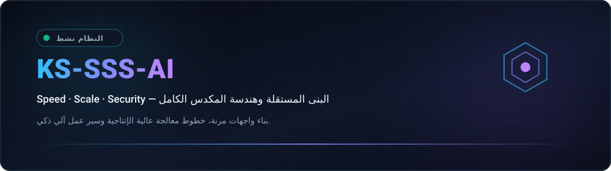
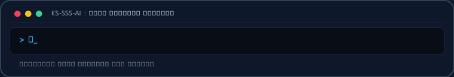
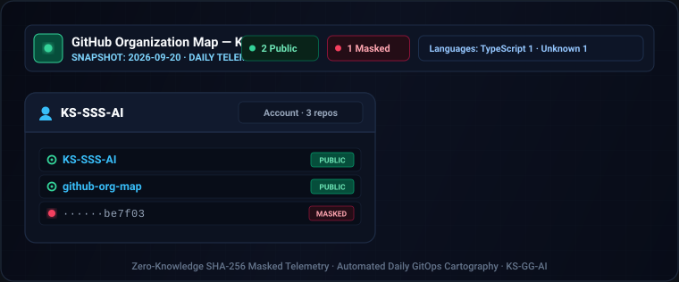
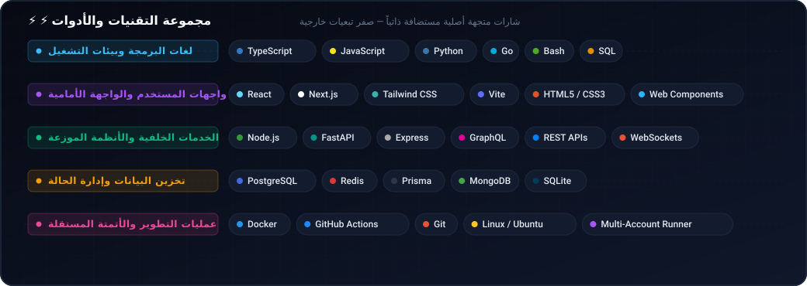
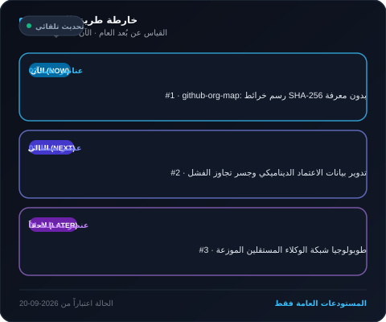
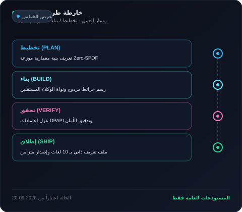
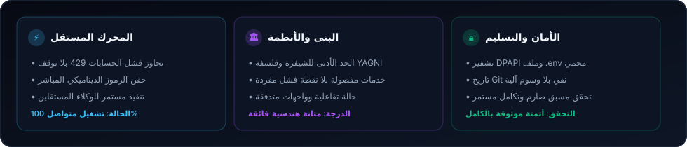
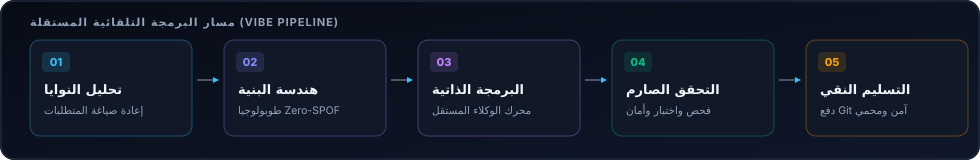

  <picture>
    <source media="(max-width: 840px)" srcset="../../assets/locales/ar/identity/hero-compact.svg" />
    
  </picture>
  <picture>
    
  </picture>

  <strong>Architecting Autonomous Systems, High-Performance Workflows &amp; Resilient Products.</strong> 
  Speed · Scale · Security — Engineering with clarity and conviction.

  <a href="../../../README.md">🇺🇸 English</a> · <a href="./ko.md">🇰🇷 한국어</a> · <a href="./zh-CN.md">🇨🇳 中文</a> · <a href="./es.md">🇪🇸 Español</a> · <a href="./hi.md">🇮🇳 हिन्दी</a> 
  <strong>🇸🇦 العربية</strong> · <a href="./pt-BR.md">🇧🇷 Português</a> · <a href="./ru.md">🇷🇺 Русский</a> · <a href="./fr.md">🇫🇷 Français</a> · <a href="./id.md">🇮🇩 Bahasa Indonesia</a>

  
  
  
  
  

---

<h2 style="display:inline-block; margin:0;">💡 حول وفلسفة الهندسة</h2>

أصمم وأبني أنظمة برمجية مرنة وسير عمل مستقل ذكي وواجهات تركز على المستخدم. يعتمد نهجي على جوهر Triple-S:

  <picture>
    
  </picture>

- **⚡ Speed** — نماذج أولية فورية بدون احتكاك، وحد أدنى من الشيفرة البرمجية لتحويل الأفكار إلى نتائج موثوقة.
- **🏛️ Scale** — بنى نظيفة ومفصولة وخدمات عديمة الحالة وطوبولوجيا متعددة العقد خالية من نقاط الفشل الفردية.
- **🔒 Security** — عزل تام لبيانات الاعتماد، وتوجيه تجاوز الفشل المستمر مع حواجز حماية أمنية مؤتمتة.

  اجعله مرناً. حافظ على وضوحه. أتمت كل عقبة.

---

<h2 style="display:inline-block; margin:0;">🚀 المشاريع والحلول المميزة</h2>

يمكن تصفح المشاريع العامة بسهولة؛ بينما تظل المشاريع الخاصة مقنعة بأمان. تُظهر خريطة المنظمة المستودعات الخاصة كتسميات مجزأة ومحمية فقط.

### الأنظمة والحلول الهندسية البارزة

<table>
  <tr>
    <td width="50%" valign="top">
      

        
      

      <h4>🗺️ <a href="https://github.com/KS-SSS-AI/github-org-map">github-org-map</a></h4>
      
<em>تخطيط طوبولوجي يومي مؤتمت لمستودعات KS-SSS-AI مع إخفاء أمني قائم على تشفير SHA-256.</em>

      

        
        
        
      

      <ul>
        <li><strong>🔄 الأتمتة</strong>: سير عمل GitHub Actions مجدول يومياً مع حماية كاملة للأسرار</li>
        <li><strong>🛡️ الخصوصية</strong>: إخفاء أسماء المستودعات الخاصة بأمان مع تصور البنية الهندسية</li>
        <li><strong>🎨 التصور المرئي</strong>: مخططات SVG ديناميكية وإنشاء صور GIF متحركة عبر الحسابات</li>
      </ul>
    </td>
    <td width="50%" valign="top">
      

        
      

      <h4>🔒 <a href="https://github.com/KS-SSS-AI/github-org-map-private">github-org-map-private</a></h4>
      
<em>مساحة عمل مصاحبة خاصة ومحرك قياس عن بُعد غير مقنع للتطوير والتدقيق الداخلي.</em>

      

        
        
        
      

      <ul>
        <li><strong>🔐 المسار المزدوج</strong>: توليد عروض طوبولوجية داخلية غير مقنعة بالتوازي مع المخرجات العامة</li>
        <li><strong>⚡ هندسة Zero-SPOF</strong>: تدوير بيانات الاعتماد متعددة الحسابات مع التبديل التلقائي عند تجاوز الحصص (429)</li>
        <li><strong>🏛️ السرية التامة</strong>: حماية الاعتمادات بنظام DPAPI مع ضمان عدم التسريب نهائياً</li>
      </ul>
    </td>
  </tr>
</table>

  <a href="https://github.com/KS-SSS-AI?tab=repositories">تصفح المستودعات العامة</a> ·
  <a href="https://github.com/KS-SSS-AI/github-org-map">استكشاف خريطة المنظمة</a>

---

<h2 style="display:inline-block; margin:0;">🚀 القدرات والبنى المميزة</h2>

<table>
  <tr>
    <td width="50%" valign="top">
      <h4>🤖 تنسيق الوكلاء المستقلين</h4>
      
<em>سير عمل وكلاء الذكاء الاصطناعي المستمر وتدوير الرموز عبر حسابات متعددة بسلاسة.</em>

      <ul>
        <li><strong>تجاوز الفشل الآلي</strong>: تدوير تلقائي دون توقف بين عدة حسابات عند الوصول للحدود (429).</li>
        <li><strong>عزل البيئة الصارم</strong>: حماية بيانات الاعتماد بواسطة مخططات بيئية وتشفير DPAPI.</li>
        <li><strong>التحكم عبر الدردشة</strong>: جسور تحكم تربط ديسكورد وتيليجرام بمحركات الوكلاء المحلية.</li>
      </ul>
    </td>
    <td width="50%" valign="top">
      <h4>🌐 أنظمة المكدس الكامل والسحابة المرنة</h4>
      
<em>تطبيقات ويب تفاعلية حديثة مدعومة بخدمات خلفية عالية التزامن والسرعة.</em>

      <ul>
        <li><strong>هندسة الواجهات</strong>: واجهات مستخدم سريعة وسهلة الوصول مبنية بـ React و Next.js و TypeScript.</li>
        <li><strong>الخدمات المصغرة</strong>: خدمات خلفية غير متزامنة عالية الأداء باستخدام Node.js و Python و Go.</li>
        <li><strong>البنية كشيفرة</strong>: خطوط معالجة CI/CD مؤتمتة، حاويات Docker ونشر مستمر خالي من التوقف.</li>
      </ul>
    </td>
  </tr>
</table>

---

<h2 style="display:inline-block; margin:0;">⚡ مجموعة التقنيات والأدوات</h2>

 

  <picture>
    
  </picture>

---

<h2 style="display:inline-block; margin:0;">🗺️ استكشاف المشاريع وخارطة الطريق</h2>

 

<strong>خريطة المنظمة والطوبولوجيا</strong>

  <a href="https://github.com/KS-SSS-AI/github-org-map">
    <picture>
      
    </picture>
  </a>

تظهر المستودعات الخاصة فقط كتسميات مقنعة بحماية أمنية.

<strong>خارطة طريق المشروع</strong>

  <a href="https://github.com/issues?q=user%3AKS-SSS-AI+is%3Aissue+is%3Aopen">
    <picture>
      
    </picture>
  </a>

<strong>خارطة طريق التطوير</strong>

  <a href="https://github.com/issues?q=user%3AKS-SSS-AI+is%3Aissue">
    <picture>
      
    </picture>
  </a>

يستخدم المشكلات العامة على GitHub فقط. أضف وسماً roadmap:* ووسماً stage:* لتضمينه تلقائياً.

---

<h2 style="display:inline-block; margin:0;">📊 لوحة تحكم البنية ومؤشرات الأداء</h2>

 

  <picture>
    
  </picture>

  <picture>
    
  </picture>

---

## 📬 التواصل والتعاون

مهتم بمناقشة البنى البرمجية المستقلة والتعاون الهندسي وتصميمات الأنظمة المبتكرة؟

[GitHub Profile](https://github.com/KS-SSS-AI) · [Public Repositories](https://github.com/KS-SSS-AI?tab=repositories) · [Send an Email](mailto:youprodie@gmail.com)
