  <picture>
    
  </picture>
  <picture>
    
  </picture>

  <strong>Architecting Autonomous Systems, High-Performance Workflows &amp; Resilient Products.</strong> 
  Speed · Scale · Security — Engineering with clarity and conviction.

  [🇺🇸 English](../../../README.md) · [🇰🇷 한국어](./ko.md) · [🇨🇳 中文](./zh-CN.md) · <strong>🇪🇸 Español</strong> · [🇮🇳 हिन्दी](./hi.md) 
  [🇸🇦 العربية](./ar.md) · [🇧🇷 Português](./pt-BR.md) · [🇷🇺 Русский](./ru.md) · [🇫🇷 Français](./fr.md) · [🇮🇩 Bahasa Indonesia](./id.md)

  
  
  
  

  

---

<h2 style="display:inline-block; margin:0;">💡 Acerca de y filosofía de ingeniería</h2>

Diseño y construyo sistemas de software resistentes, canalizaciones autónomas inteligentes e interfaces centradas en el usuario. Mi enfoque se centra en el núcleo Triple-S:

- **⚡ Speed** — Prototipado sin fricciones, paradigmas de código mínimo y bucles de agentes que convierten la intención en código verificado.
- **🏛️ Scale** — Arquitecturas desacopladas limpias, servicios sin estado y topologías multinodo sin SPOF.
- **🔒 Security** — Aislamiento de credenciales de confianza cero, enrutamiento de conmutación por error y medidas de seguridad automatizadas.

  Hazlo resistente. Mantenlo claro. Automatiza la fricción.

---

<h2 style="display:inline-block; margin:0;">🚀 Capacidades y arquitecturas destacadas</h2>

<table>
  <tr>
    <td width="50%" valign="top">
      <h4>🤖 Orquestación de agentes autónomos</h4>
      
<em>Flujos de trabajo de agentes de IA continuos, tiempo de ejecución de herramientas y rotación de tokens.</em>

      <ul>
        <li><strong>Quota Failover</strong>: Zero-downtime automatic rotation across multiple accounts upon rate limit (429) triggers.</li>
        <li><strong>Environment Isolation</strong>: Credential encapsulation via portable environment schemas and DPAPI-level guardrails.</li>
        <li><strong>Chat-Driven Control</strong>: Remote command delegation bridges connecting Discord and Telegram to local agent engines.</li>
      </ul>
    </td>
    <td width="50%" valign="top">
      <h4>🌐 Sistemas resilientes full-stack y cloud</h4>
      
<em>Aplicaciones web modernas interactivas impulsadas por servicios backend de alta concurrencia.</em>

      <ul>
        <li><strong>Frontend Engineering</strong>: Fast, accessible client interfaces built with React, Next.js, and TypeScript.</li>
        <li><strong>Microservices &amp; APIs</strong>: High-concurrency asynchronous backends utilizing Node.js, Python, and Go.</li>
        <li><strong>Infrastructure as Code</strong>: Automated CI/CD pipelines, Docker containerization, and cloud deployment targets.</li>
      </ul>
    </td>
  </tr>
</table>

---

<h2 style="display:inline-block; margin:0;">⚡ Pila tecnológica y herramientas</h2>

 

  <picture>
    
  </picture>

---

<h2 style="display:inline-block; margin:0;">📊 Panel de arquitectura y métricas de entrega</h2>

 

  <picture>
    
  </picture>

  <picture>
    
  </picture>

---

## 📬 Conectar y colaborar

¿Interesado en discutir arquitecturas de software autónomas, colaboración de ingeniería o diseños innovadores?

[GitHub Profile](https://github.com/KS-SSS-AI) · [Public Repositories](https://github.com/KS-SSS-AI?tab=repositories) · [Send an Email](mailto:youprodie@gmail.com)
