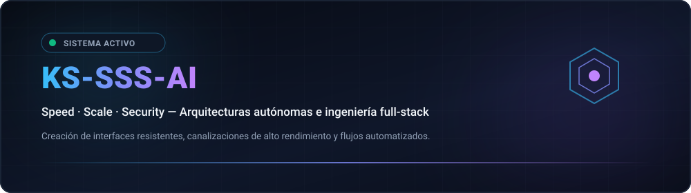
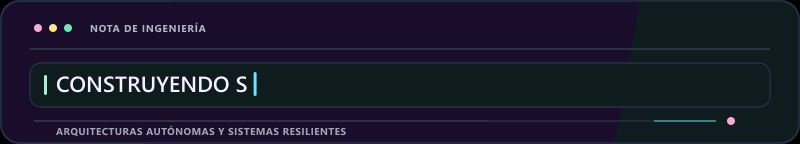
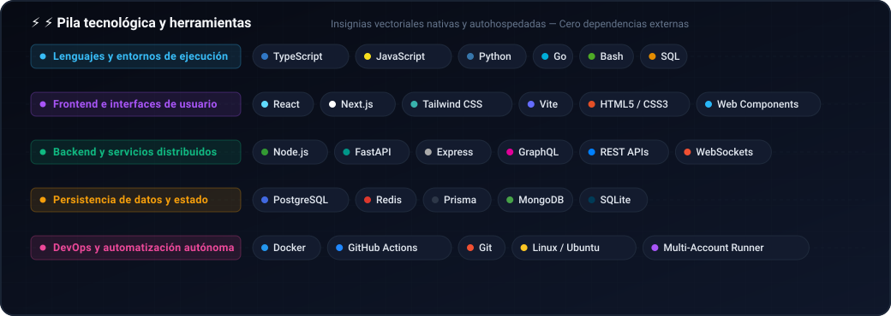
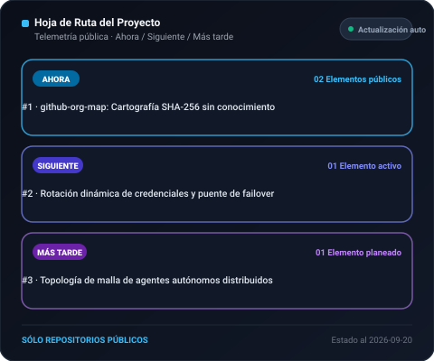
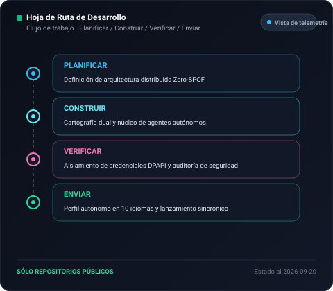
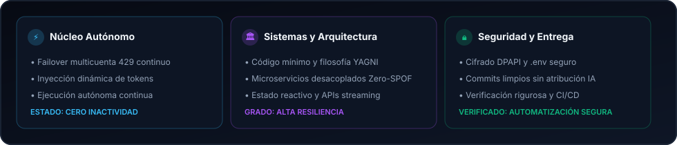

  <picture>
    <source media="(max-width: 840px)" srcset="../../assets/locales/es/identity/hero-compact.svg" />
    
  </picture>
  <picture>
    
  </picture>

  <strong>Architecting Autonomous Systems, High-Performance Workflows &amp; Resilient Products.</strong> 
  Speed · Scale · Security — Engineering with clarity and conviction.

  <a href="../../../README.md">🇺🇸 English</a> · <a href="./ko.md">🇰🇷 한국어</a> · <a href="./zh-CN.md">🇨🇳 中文</a> · <strong>🇪🇸 Español</strong> · <a href="./hi.md">🇮🇳 हिन्दी</a> 
  <a href="./ar.md">🇸🇦 العربية</a> · <a href="./pt-BR.md">🇧🇷 Português</a> · <a href="./ru.md">🇷🇺 Русский</a> · <a href="./fr.md">🇫🇷 Français</a> · <a href="./id.md">🇮🇩 Bahasa Indonesia</a>

  
  
  
  
  

---

<h2 style="display:inline-block; margin:0;">💡 Acerca de y filosofía de ingeniería</h2>

Diseño y construyo sistemas de software resistentes, canalizaciones autónomas inteligentes e interfaces centradas en el usuario. Mi enfoque se centra en el núcleo Triple-S:

  <picture>
    
  </picture>

- **⚡ Speed** — Prototipado sin fricciones, paradigmas de código mínimo y bucles de agentes que convierten la intención en código verificado.
- **🏛️ Scale** — Arquitecturas desacopladas limpias, servicios sin estado y topologías multinodo sin SPOF.
- **🔒 Security** — Aislamiento de credenciales de confianza cero, enrutamiento de conmutación por error y medidas de seguridad automatizadas.

  Hazlo resistente. Mantenlo claro. Automatiza la fricción.

---

<h2 style="display:inline-block; margin:0;">🚀 Proyectos y soluciones destacadas</h2>

El trabajo público es fácilmente navegable; el trabajo privado se mantiene intencionadamente enmascarado. El mapa de la organización muestra los repositorios privados solo como etiquetas con hash seguro.

### Sistemas y soluciones de ingeniería

<table>
  <tr>
    <td width="50%" valign="top">
      

        
      

      <h4>🗺️ <a href="https://github.com/KS-SSS-AI/github-org-map">github-org-map</a></h4>
      
<em>Mapeo topológico y cartografía diaria automatizada de repositorios con preservación de privacidad SHA-256.</em>

      

        
        
        
      

      <ul>
        <li><strong>🔄 Automatización</strong>: Flujo de trabajo diario programado de GitHub Actions sin fuga de secretos</li>
        <li><strong>🛡️ Privacidad</strong>: Enmascara deliberadamente identificadores privados mientras visualiza la arquitectura</li>
        <li><strong>🎨 Visualización</strong>: Diagramas vectoriales SVG dinámicos y generación de GIF animados</li>
      </ul>
    </td>
    <td width="50%" valign="top">
      

        
      

      <h4>🔒 <a href="https://github.com/KS-SSS-AI/github-org-map-private">github-org-map-private</a></h4>
      
<em>Espacio de trabajo complementario privado y motor de telemetría sin enmascarar para desarrollo interno.</em>

      

        
        
        
      

      <ul>
        <li><strong>🔐 Tubería dual</strong>: Genera vistas de topología internas sin enmascarar junto con artefactos públicos</li>
        <li><strong>⚡ Topología Zero-SPOF</strong>: Rotación de credenciales multicuenta con conmutación por error ante límites 429</li>
        <li><strong>🏛️ Confidencialidad</strong>: Aislamiento estricto de secretos con DPAPI y garantía total de cero fugas</li>
      </ul>
    </td>
  </tr>
</table>

  <a href="https://github.com/KS-SSS-AI?tab=repositories">Explorar repositorios públicos</a> ·
  <a href="https://github.com/KS-SSS-AI/github-org-map">Ver repositorio del mapa de organización</a>

---

<h2 style="display:inline-block; margin:0;">🚀 Capacidades y arquitecturas destacadas</h2>

<table>
  <tr>
    <td width="50%" valign="top">
      <h4>🤖 Orquestación de agentes autónomos</h4>
      
<em>Flujos de trabajo de agentes de IA continuos, tiempo de ejecución de herramientas y rotación de tokens.</em>

      <ul>
        <li><strong>Conmutación por error</strong>: Rotación automática sin tiempo de inactividad entre múltiples cuentas ante límites (429).</li>
        <li><strong>Aislamiento de entorno</strong>: Encapsulación de credenciales mediante esquemas portátiles y protección DPAPI.</li>
        <li><strong>Control vía chat</strong>: Puentes de delegación remota que conectan Discord y Telegram con agentes locales.</li>
      </ul>
    </td>
    <td width="50%" valign="top">
      <h4>🌐 Sistemas resilientes full-stack y cloud</h4>
      
<em>Aplicaciones web modernas interactivas impulsadas por servicios backend de alta concurrencia.</em>

      <ul>
        <li><strong>Ingeniería Frontend</strong>: Interfaces accesibles y ultrarrápidas construidas con React, Next.js y TypeScript.</li>
        <li><strong>Microservicios y APIs</strong>: Servicios asíncronos de alta concurrencia desarrollados en Node.js, Python y Go.</li>
        <li><strong>Infraestructura como código</strong>: Pipelines automatizados de CI/CD, contenedores Docker y despliegue continuo.</li>
      </ul>
    </td>
  </tr>
</table>

---

<h2 style="display:inline-block; margin:0;">⚡ Pila tecnológica y herramientas</h2>

 

  <picture>
    
  </picture>

---

<h2 style="display:inline-block; margin:0;">🗺️ Exploración de proyectos y hoja de ruta</h2>

 

<strong>Mapa y topología de la organización</strong>

  <a href="https://github.com/KS-SSS-AI/github-org-map">
    <picture>
      
    </picture>
  </a>

Los repositorios privados aparecen únicamente como etiquetas enmascaradas.

<strong>Hoja de Ruta del Proyecto</strong>

  <a href="https://github.com/issues?q=user%3AKS-SSS-AI+is%3Aissue+is%3Aopen">
    <picture>
      
    </picture>
  </a>

<strong>Hoja de Ruta de Desarrollo</strong>

  <a href="https://github.com/issues?q=user%3AKS-SSS-AI+is%3Aissue">
    <picture>
      
    </picture>
  </a>

Utiliza únicamente issues públicas de GitHub. Añade una etiqueta roadmap:* y una etiqueta stage:* para que aparezca.

---

<h2 style="display:inline-block; margin:0;">📊 Panel de arquitectura y métricas de entrega</h2>

 

  <picture>
    
  </picture>

  <picture>
    
  </picture>

---

## 📬 Conectar y colaborar

¿Interesado en discutir arquitecturas de software autónomas, colaboración de ingeniería o diseños innovadores?

[GitHub Profile](https://github.com/KS-SSS-AI) · [Public Repositories](https://github.com/KS-SSS-AI?tab=repositories) · [Send an Email](mailto:youprodie@gmail.com)
