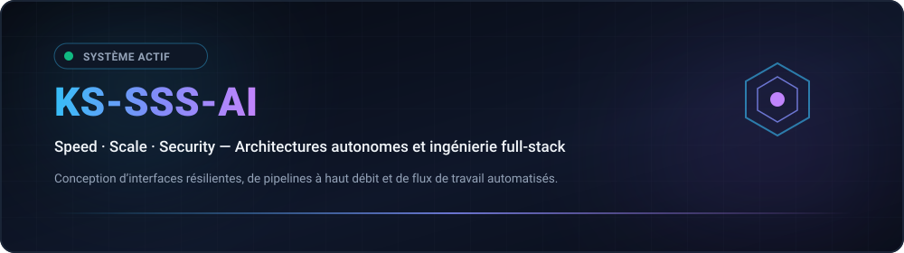
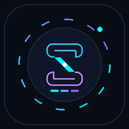
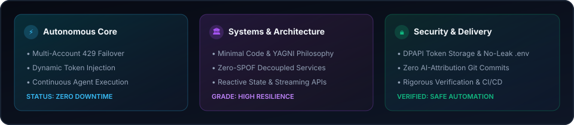
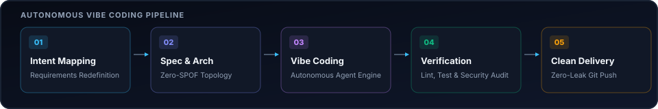

  <picture>
    
  </picture>
  <picture>
    
  </picture>

  <strong>Architecting Autonomous Systems, High-Performance Workflows &amp; Resilient Products.</strong> 
  Speed · Scale · Security — Engineering with clarity and conviction.

  <a href="../../../README.md">🇺🇸 English</a> · <a href="./ko.md">🇰🇷 한국어</a> · <a href="./zh-CN.md">🇨🇳 中文</a> · <a href="./es.md">🇪🇸 Español</a> · <a href="./hi.md">🇮🇳 हिन्दी</a> 
  <a href="./ar.md">🇸🇦 العربية</a> · <a href="./pt-BR.md">🇧🇷 Português</a> · <a href="./ru.md">🇷🇺 Русский</a> · <strong>🇫🇷 Français</strong> · <a href="./id.md">🇮🇩 Bahasa Indonesia</a>

  
  
  
  

  

---

<h2 style="display:inline-block; margin:0;">💡 Philosophie d’ingénierie</h2>

Je conçois et développe des systèmes logiciels résilients, des pipelines autonomes intelligents et des interfaces centrées sur l’utilisateur. Mon approche repose sur le socle Triple-S :

- **⚡ Speed** — Prototypage sans friction, code minimal et boucles d’agents autonomes transformant les idées en livrables vérifiés.
- **🏛️ Scale** — Architectures découplées, services sans état et topologies multi-nœuds sans point unique de défaillance (Zero-SPOF).
- **🔒 Security** — Isolation Zero-Trust des identifiants, basculement automatique continu et garde-fous de sécurité intégrés.

  Rendre résilient. Garder la clarté. Automatiser les frictions.

---

<h2 style="display:inline-block; margin:0;">🚀 Capacités et architectures clés</h2>

<table>
  <tr>
    <td width="50%" valign="top">
      <h4>🤖 Orchestration d’agents autonomes</h4>
      
<em>Flux de travail continus d’agents IA, exécution d’outils et rotation transparente des identifiants.</em>

      <ul>
        <li><strong>Quota Failover</strong>: Zero-downtime automatic rotation across multiple accounts upon rate limit (429) triggers.</li>
        <li><strong>Environment Isolation</strong>: Credential encapsulation via portable environment schemas and DPAPI-level guardrails.</li>
        <li><strong>Chat-Driven Control</strong>: Remote command delegation bridges connecting Discord and Telegram to local agent engines.</li>
      </ul>
    </td>
    <td width="50%" valign="top">
      <h4>🌐 Systèmes résilients Full-Stack et Cloud</h4>
      
<em>Applications web interactives modernes propulsées par des services backend asynchrones à haute concurrence.</em>

      <ul>
        <li><strong>Frontend Engineering</strong>: Fast, accessible client interfaces built with React, Next.js, and TypeScript.</li>
        <li><strong>Microservices &amp; APIs</strong>: High-concurrency asynchronous backends utilizing Node.js, Python, and Go.</li>
        <li><strong>Infrastructure as Code</strong>: Automated CI/CD pipelines, Docker containerization, and cloud deployment targets.</li>
      </ul>
    </td>
  </tr>
</table>

---

<h2 style="display:inline-block; margin:0;">⚡ Stack technologique et outils</h2>

 

  <picture>
    
  </picture>

---

<h2 style="display:inline-block; margin:0;">📊 Tableau de bord d’architecture et métriques</h2>

 

  <picture>
    
  </picture>

  <picture>
    
  </picture>

---

## 📬 Contact et collaboration

Intéressé par l’architecture logicielle autonome, la collaboration technique ou la conception de systèmes novateurs ?

[GitHub Profile](https://github.com/KS-SSS-AI) · [Public Repositories](https://github.com/KS-SSS-AI?tab=repositories) · [Send an Email](mailto:youprodie@gmail.com)
