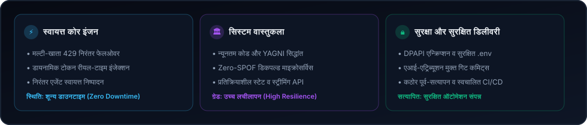
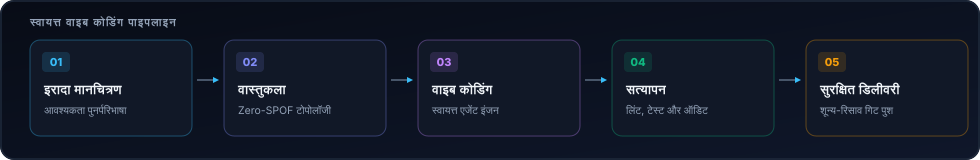

  <picture>
    
  </picture>
  <picture>
    
  </picture>

  <strong>Architecting Autonomous Systems, High-Performance Workflows &amp; Resilient Products.</strong> 
  Speed · Scale · Security — Engineering with clarity and conviction.

  <a href="../../../README.md">🇺🇸 English</a> · <a href="./ko.md">🇰🇷 한국어</a> · <a href="./zh-CN.md">🇨🇳 中文</a> · <a href="./es.md">🇪🇸 Español</a> · <strong>🇮🇳 हिन्दी</strong> 
  <a href="./ar.md">🇸🇦 العربية</a> · <a href="./pt-BR.md">🇧🇷 Português</a> · <a href="./ru.md">🇷🇺 Русский</a> · <a href="./fr.md">🇫🇷 Français</a> · <a href="./id.md">🇮🇩 Bahasa Indonesia</a>

  
  
  
  

  

---

<h2 style="display:inline-block; margin:0;">💡 परिचय एवं इंजीनियरिंग सिद्धांत</h2>

मैं लचीले सॉफ्टवेयर सिस्टम, स्वायत्त पाइपलाइन और उपयोगकर्ता-केंद्रित इंटरफेस डिजाइन और विकसित करता हूँ। मेरा दृष्टिकोण ट्रिपल-एस (Triple-S) पर केंद्रित है:

- **⚡ Speed** — शून्य-घर्षण प्रोटोटाइपिंग, न्यूनतम कोड और स्वायत्त एजेंट चक्र जो विचारों को त्वरित सत्यापित कोड में बदलते हैं।
- **🏛️ Scale** — साफ़ डिकपल्ड आर्किटेक्चर, स्टेटलेस सेवाएं और बिना एकल विफलता बिंदु (Zero-SPOF) वाले मल्टी-नोड टोपोलॉजी।
- **🔒 Security** — जीरो-ट्रस्ट क्रेडेंशियल आइसोलेशन, निरंतर विफलता रूटिंग और स्वचालित सुरक्षा मानक।

  इसे लचीला बनाएं। इसे स्पष्ट रखें। घर्षण को स्वचालित रूप से समाप्त करें।

---

<h2 style="display:inline-block; margin:0;">🚀 प्रमुख परियोजनाएं और समाधान</h2>

सार्वजनिक कार्य को आसानी से देखा जा सकता है; निजी कार्य जानबूझकर सुरक्षित रूप से छिपाया जाता है। संगठन मानचित्र में निजी रिपॉजिटरी केवल सुरक्षित नमकीन हैश लेबल के रूप में दिखाई देती हैं।

### विशेष प्रणालियाँ और समाधान

<table>
  <tr>
    <td width="50%" valign="top">
      

        
      

      <h4>🗺️ <a href="https://github.com/KS-SSS-AI/github-org-map">github-org-map</a></h4>
      
<em>शून्य-ज्ञान SHA-256 मास्किंग के साथ KS-SSS-AI रिपॉजिटरी का स्वचालित दैनिक टोपोलॉजी मानचित्रण।</em>

      

        
        
        
      

      <ul>
        <li><strong>🔄 स्वचालन</strong>: शून्य टोकन लीक के साथ दैनिक अनुसूचित GitHub Actions वर्कफ़्लो</li>
        <li><strong>🛡️ गोपनीयता</strong>: आर्किटेक्चर की कल्पना करते समय निजी रिपॉजिटरी पहचानकर्ताओं को सुरक्षित रूप से छुपाता है</li>
        <li><strong>🎨 विज़ुअलाइज़ेशन</strong>: सभी खातों में गतिशील SVG आरेख और एनिमेटेड GIF निर्माण</li>
      </ul>
    </td>
    <td width="50%" valign="top">
      

        
      

      <h4>🔒 <a href="https://github.com/KS-SSS-AI/github-org-map-private">github-org-map-private</a></h4>
      
<em>आंतरिक विकास और निरंतर ऑडिट के लिए निजी साथी कार्यक्षेत्र और टेलीमेट्री इंजन।</em>

      

        
        
        
      

      <ul>
        <li><strong>🔐 दोहरी पाइपलाइन</strong>: सार्वजनिक मास्क कलाकृतियों के साथ-साथ आंतरिक अनावृत टोपोलॉजी दृश्य उत्पन्न करता है</li>
        <li><strong>⚡ Zero-SPOF टोपोलॉजी</strong>: स्वचालित 429 विफलता के साथ बहु-खाता क्रेडेंशियल रोटेशन</li>
        <li><strong>🏛️ गोपनीयता</strong>: DPAPI सुरक्षा और सख्त शून्य-रिसाव गारंटी के साथ सुरक्षित क्रेडेंशियल</li>
      </ul>
    </td>
  </tr>
</table>

  <a href="https://github.com/KS-SSS-AI?tab=repositories">सार्वजनिक रिपॉजिटरी ब्राउज़ करें</a> ·
  <a href="https://github.com/KS-SSS-AI/github-org-map">संगठन मानचित्र देखें</a>

---

<h2 style="display:inline-block; margin:0;">🚀 मुख्य क्षमताएं एवं वास्तुकला</h2>

<table>
  <tr>
    <td width="50%" valign="top">
      <h4>🤖 स्वायत्त एजेंट ऑर्केस्ट्रेशन</h4>
      
<em>निरंतर एआई एजेंट वर्कफ़्लो, टूल निष्पादन और स्वचालित मल्टी-खाता टोकन रोटेशन।</em>

      <ul>
        <li><strong>कोटा विफलता निवारण</strong>: 429 सीमा पर बहु-खातों में शून्य-डाउनटाइम स्वचालित रोटेशन वास्तुकला।</li>
        <li><strong>पर्यावरण अलगाव</strong>: सुरक्षित स्कीमा और DPAPI द्वारा क्रेडेंशियल सुरक्षा जिससे रिसाव न हो।</li>
        <li><strong>चैट-नियंत्रित वर्कफ़्लो</strong>: डिस्कॉर्ड और टेलीग्राम से स्थानीय एजेंट इंजन को नियंत्रित करने वाले ब्रिज।</li>
      </ul>
    </td>
    <td width="50%" valign="top">
      <h4>🌐 लचीला फुल-स्टैक और क्लाउड सिस्टम</h4>
      
<em>उच्च-संवर्ती बैकएंड सेवाओं द्वारा संचालित आधुनिक वेब अनुप्रयोग।</em>

      <ul>
        <li><strong>फ्रंटएंड इंजीनियरिंग</strong>: React, Next.js और TypeScript पर आधारित तीव्र और सुलभ यूजर इंटरफेस।</li>
        <li><strong>माइक्रोसर्विस और API</strong>: Node.js, Python और Go पर निर्मित उच्च-संवर्ती अतुल्यकालिक बैकएंड सेवाएँ।</li>
        <li><strong>इन्फ्रास्ट्रक्चर एज़ कोड</strong>: GitHub Actions स्वचालित CI/CD और Docker कंटेनर निरंतर तैनाती।</li>
      </ul>
    </td>
  </tr>
</table>

---

<h2 style="display:inline-block; margin:0;">⚡ प्रौद्योगिकी स्टैक और उपकरण</h2>

 

  <picture>
    
  </picture>

---

<h2 style="display:inline-block; margin:0;">🗺️ परियोजनाएं और रोडमैप अन्वेषण</h2>

 

<strong>संगठन मानचित्र और टोपोलॉजी</strong>

  <a href="https://github.com/KS-SSS-AI/github-org-map">
    <picture>
      
    </picture>
  </a>

निजी रिपॉजिटरी केवल नकाबपोश लेबल के रूप में दिखाई देती हैं।

---

<h2 style="display:inline-block; margin:0;">📊 आर्किटेक्चर डैशबोर्ड और मेट्रिक्स</h2>

 

  <picture>
    
  </picture>

  <picture>
    
  </picture>

---

## 📬 संपर्क और सहयोग

स्वायत्त सॉफ्टवेयर आर्किटेक्चर, इंजीनियरिंग सहयोग और नए सिस्टम डिजाइनों पर चर्चा के लिए स्वागत है।

[GitHub Profile](https://github.com/KS-SSS-AI) · [Public Repositories](https://github.com/KS-SSS-AI?tab=repositories) · [Send an Email](mailto:youprodie@gmail.com)
