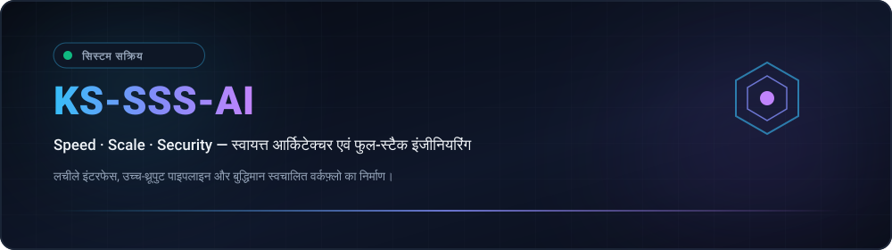

  <picture>
    
  </picture>
  <picture>
    
  </picture>

  <strong>Architecting Autonomous Systems, High-Performance Workflows &amp; Resilient Products.</strong> 
  Speed · Scale · Security — Engineering with clarity and conviction.

  [🇺🇸 English](../../../README.md) · [🇰🇷 한국어](./ko.md) · [🇨🇳 中文](./zh-CN.md) · [🇪🇸 Español](./es.md) · <strong>🇮🇳 हिन्दी</strong> 
  [🇸🇦 العربية](./ar.md) · [🇧🇷 Português](./pt-BR.md) · [🇷🇺 Русский](./ru.md) · [🇫🇷 Français](./fr.md) · [🇮🇩 Bahasa Indonesia](./id.md)

  
  
  
  

  

---

<h2 style="display:inline-block; margin:0;">💡 परिचय एवं इंजीनियरिंग सिद्धांत</h2>

मैं लचीले सॉफ्टवेयर सिस्टम, स्वायत्त पाइपलाइन और उपयोगकर्ता-केंद्रित इंटरफेस डिजाइन और विकसित करता हूँ। मेरा दृष्टिकोण ट्रिपल-एस (Triple-S) पर केंद्रित है:

- **⚡ Speed** — शून्य-घर्षण प्रोटोटाइपिंग, न्यूनतम कोड और स्वायत्त एजेंट चक्र जो विचारों को त्वरित सत्यापित कोड में बदलते हैं।
- **🏛️ Scale** — साफ़ डिकपल्ड आर्किटेक्चर, स्टेटलेस सेवाएं और बिना एकल विफलता बिंदु (Zero-SPOF) वाले मल्टी-नोड टोपोलॉजी।
- **🔒 Security** — जीरो-ट्रस्ट क्रेडेंशियल आइसोलेशन, निरंतर विफलता रूटिंग और स्वचालित सुरक्षा मानक।

  इसे लचीला बनाएं। इसे स्पष्ट रखें। घर्षण को स्वचालित रूप से समाप्त करें।

---

<h2 style="display:inline-block; margin:0;">🚀 मुख्य क्षमताएं एवं वास्तुकला</h2>

<table>
  <tr>
    <td width="50%" valign="top">
      <h4>🤖 स्वायत्त एजेंट ऑर्केस्ट्रेशन</h4>
      
<em>निरंतर एआई एजेंट वर्कफ़्लो, टूल निष्पादन और स्वचालित मल्टी-खाता टोकन रोटेशन।</em>

      <ul>
        <li><strong>Quota Failover</strong>: Zero-downtime automatic rotation across multiple accounts upon rate limit (429) triggers.</li>
        <li><strong>Environment Isolation</strong>: Credential encapsulation via portable environment schemas and DPAPI-level guardrails.</li>
        <li><strong>Chat-Driven Control</strong>: Remote command delegation bridges connecting Discord and Telegram to local agent engines.</li>
      </ul>
    </td>
    <td width="50%" valign="top">
      <h4>🌐 लचीला फुल-स्टैक और क्लाउड सिस्टम</h4>
      
<em>उच्च-संवर्ती बैकएंड सेवाओं द्वारा संचालित आधुनिक वेब अनुप्रयोग।</em>

      <ul>
        <li><strong>Frontend Engineering</strong>: Fast, accessible client interfaces built with React, Next.js, and TypeScript.</li>
        <li><strong>Microservices &amp; APIs</strong>: High-concurrency asynchronous backends utilizing Node.js, Python, and Go.</li>
        <li><strong>Infrastructure as Code</strong>: Automated CI/CD pipelines, Docker containerization, and cloud deployment targets.</li>
      </ul>
    </td>
  </tr>
</table>

---

<h2 style="display:inline-block; margin:0;">⚡ प्रौद्योगिकी स्टैक और उपकरण</h2>

 

  <picture>
    
  </picture>

---

<h2 style="display:inline-block; margin:0;">📊 आर्किटेक्चर डैशबोर्ड और मेट्रिक्स</h2>

 

  <picture>
    
  </picture>

  <picture>
    
  </picture>

---

## 📬 संपर्क और सहयोग

स्वायत्त सॉफ्टवेयर आर्किटेक्चर, इंजीनियरिंग सहयोग और नए सिस्टम डिजाइनों पर चर्चा के लिए स्वागत है।

[GitHub Profile](https://github.com/KS-SSS-AI) · [Public Repositories](https://github.com/KS-SSS-AI?tab=repositories) · [Send an Email](mailto:youprodie@gmail.com)
