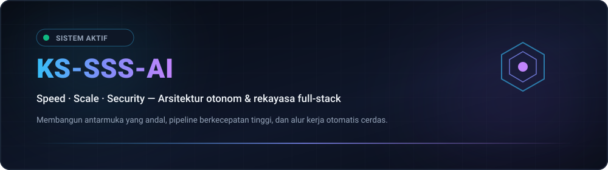
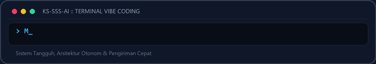
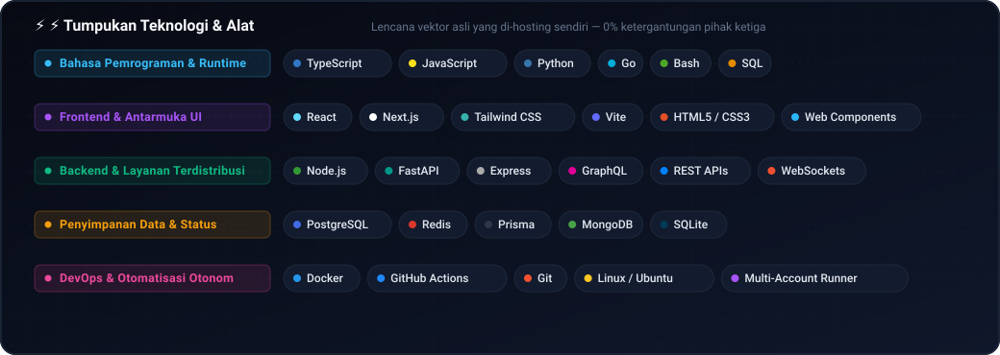
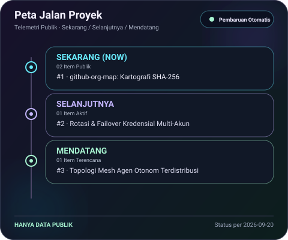
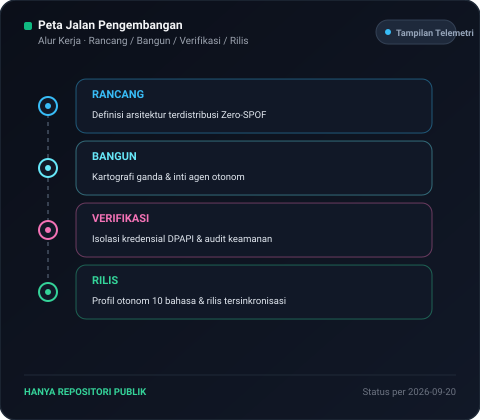
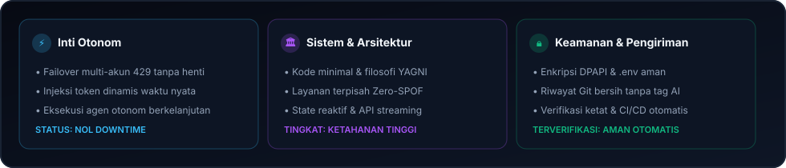
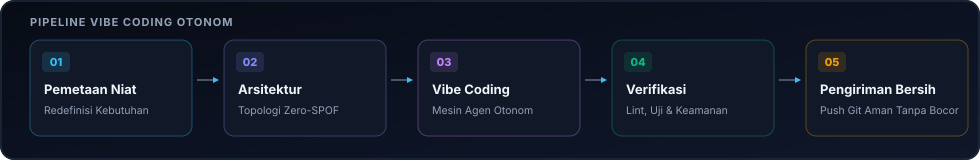

  <picture>
    <source media="(max-width: 840px)" srcset="../../assets/locales/id/identity/hero-compact.svg" />
    
  </picture>
  <picture>
    
  </picture>

  <strong>Architecting Autonomous Systems, High-Performance Workflows &amp; Resilient Products.</strong> 
  Speed · Scale · Security — Engineering with clarity and conviction.

  <a href="../../../README.md">🇺🇸 English</a> · <a href="./ko.md">🇰🇷 한국어</a> · <a href="./zh-CN.md">🇨🇳 中文</a> · <a href="./es.md">🇪🇸 Español</a> · <a href="./hi.md">🇮🇳 हिन्दी</a> 
  <a href="./ar.md">🇸🇦 العربية</a> · <a href="./pt-BR.md">🇧🇷 Português</a> · <a href="./ru.md">🇷🇺 Русский</a> · <a href="./fr.md">🇫🇷 Français</a> · <strong>🇮🇩 Bahasa Indonesia</strong>

  
  
  
  
  
  

---

<h2 style="display:inline-block; margin:0;">💡 Tentang &amp; Filosofi Rekayasa</h2>

Saya merancang dan membangun sistem perangkat lunak yang tangguh, alur kerja otonom cerdas, dan antarmuka ramah pengguna. Pendekatan saya berpusat pada inti Triple-S:

  <picture>
    
  </picture>

- **⚡ Speed** — Prototyping tanpa hambatan, paradigma kode minimal, dan loop agen otonom untuk merealisasikan ide dengan cepat.
- **🏛️ Scale** — Arsitektur terpisah yang bersih, layanan tanpa status, dan topologi multi-node tanpa titik kegagalan tunggal (Zero-SPOF).
- **🔒 Security** — Isolasi kredensial Zero-Trust, perutean failover berkelanjutan, dan perlindungan keamanan otomatis.

  Jadikan tangguh. Tetap jelas. Otomatiskan setiap hambatan.

---

<h2 style="display:inline-block; margin:0;">🚀 Proyek Unggulan &amp; Solusi Arsitektur</h2>

Pekerjaan publik mudah dijelajahi; proyek privat sengaja disamarkan demi keamanan. Peta organisasi hanya menampilkan repositori privat sebagai label hash yang aman.

### Sistem Unggulan &amp; Solusi Rekayasa

<table>
  <tr>
    <td width="50%" valign="top">
      

        
      

      <h4>🗺️ <a href="https://github.com/KS-SSS-AI/github-org-map">github-org-map</a></h4>
      
<em>Pemetaan topologi harian repositori otomatis dengan penyembunyian privasi SHA-256 tanpa pengetahuan.</em>

      

        
        
        
      

      <ul>
        <li><strong>🔄 Otomasi Penuh</strong>: Alur kerja harian GitHub Actions terjadwal tanpa kebocoran rahasia</li>
        <li><strong>🛡️ Perlindungan Privasi</strong>: Menyamarkan nama repositori privat secara aman saat memvisualisasikan arsitektur</li>
        <li><strong>🎨 Visualisasi Vektor</strong>: Diagram SVG dinamis dan pembuatan GIF animasi di semua akun</li>
      </ul>
    </td>
    <td width="50%" valign="top">
      

        
      

      <h4>🔒 <a href="https://github.com/KS-SSS-AI/github-org-map-private">github-org-map-private</a></h4>
      
<em>Ruang kerja privat pendamping dan mesin telemetri tanpa masking untuk pengembangan internal.</em>

      

        
        
        
      

      <ul>
        <li><strong>🔐 Jalur Ganda</strong>: Menghasilkan tampilan topologi internal tanpa masking di samping artefak publik</li>
        <li><strong>⚡ Topologi Zero-SPOF</strong>: Rotasi multi-akun dengan failover otomatis saat mencapai batas 429</li>
        <li><strong>🏛️ Kerahasiaan Ketat</strong>: Enkapsulasi kredensial dengan DPAPI dan jaminan nol kebocoran</li>
      </ul>
    </td>
  </tr>
</table>

  <a href="https://github.com/KS-SSS-AI?tab=repositories">Jelajahi Repositori Publik</a> ·
  <a href="https://github.com/KS-SSS-AI/github-org-map">Buka Peta Organisasi</a>

---

<h2 style="display:inline-block; margin:0;">🚀 Kemampuan dan Arsitektur Unggulan</h2>

<table>
  <tr>
    <td width="50%" valign="top">
      <h4>🤖 Orkestrasi Agen Otonom</h4>
      
<em>Alur kerja agen AI berkelanjutan, eksekusi alat runtime, dan rotasi kredensial multi-akun.</em>

      <ul>
        <li><strong>Failover Kuota</strong>: Rotasi otomatis multi-akun tanpa downtime saat mencapai batas rate limit (429).</li>
        <li><strong>Isolasi Lingkungan</strong>: Enkapsulasi kredensial melalui skema portabel dan perlindungan DPAPI.</li>
        <li><strong>Kontrol via Obrolan</strong>: Jembatan delegasi perintah menghubungkan Discord dan Telegram ke mesin lokal.</li>
      </ul>
    </td>
    <td width="50%" valign="top">
      <h4>🌐 Sistem Tangguh Full-Stack &amp; Cloud</h4>
      
<em>Aplikasi web interaktif modern yang didukung oleh layanan backend asinkron berkinerja tinggi.</em>

      <ul>
        <li><strong>Rekayasa Frontend</strong>: Antarmuka pengguna yang cepat dan mudah diakses berbasis React, Next.js, dan TypeScript.</li>
        <li><strong>Layanan Mikro &amp; API</strong>: Layanan backend asinkron konkurensi tinggi yang dibangun dengan Node.js, Python, dan Go.</li>
        <li><strong>Infrastruktur Kode</strong>: Otomatisasi CI/CD dengan GitHub Actions dan kontainerisasi Docker tanpa downtime.</li>
      </ul>
    </td>
  </tr>
</table>

---

<h2 style="display:inline-block; margin:0;">⚡ Tumpukan Teknologi &amp; Alat</h2>

<em>Lencana vektor asli yang di-hosting sendiri — 0% ketergantungan pihak ketiga</em>

- **Languages &amp; Runtimes** — TypeScript, JavaScript, Python, Go, Bash, SQL, HTML5, CSS3
- **Surfaces &amp; Frontend** — React, Next.js, Vite, Tailwind CSS, Web Components
- **Microservices &amp; APIs** — Node.js, FastAPI, Express, GraphQL, REST APIs, WebSockets
- **Databases &amp; Caches** — PostgreSQL, Redis, Prisma, MongoDB, SQLite
- **Delivery &amp; Orchestration** — Docker, GitHub Actions, Linux / Ubuntu, Multi-Account Runner

<strong>Explore the visual stack &amp; live motion</strong>

 

<strong>Technical map</strong>

<picture>
  <source media="(max-width: 840px)" srcset="../../assets/locales/id/visuals/technology-stack-compact.svg" />
  
</picture>

<strong>In motion</strong>

<picture>
  
</picture>

---

<h2 style="display:inline-block; margin:0;">🗺️ Eksplorasi Proyek &amp; Peta Jalan</h2>

 

<strong>Peta Organisasi &amp; Topologi</strong>

  <a href="https://github.com/KS-SSS-AI/github-org-map">
    <picture>
      
    </picture>
  </a>

Repositori privat hanya ditampilkan sebagai label yang disamarkan.

<strong>Peta Jalan Proyek</strong>

  <a href="https://github.com/issues?q=user%3AKS-SSS-AI+is%3Aissue+is%3Aopen">
    <picture>
      
    </picture>
  </a>

<strong>Peta Jalan Pengembangan</strong>

  <a href="https://github.com/issues?q=user%3AKS-SSS-AI+is%3Aissue">
    <picture>
      
    </picture>
  </a>

Hanya menggunakan GitHub issue publik. Tambahkan satu label roadmap:* dan satu label stage:* agar muncul otomatis.

---

<h2 style="display:inline-block; margin:0;">📊 Dasbor Arsitektur &amp; Metrik Pengiriman</h2>

 

  <picture>
    <source media="(max-width: 840px)" srcset="../../assets/locales/id/visuals/architecture-metrics-compact.svg" />
    
  </picture>

  <picture>
    <source media="(max-width: 840px)" srcset="../../assets/locales/id/visuals/workflow-pipeline-compact.svg" />
    
  </picture>

  <a href="../../docs/architecture.md">📖 Explore Full Architecture Specification &amp; Governance</a>

---

## 📬 Hubungi &amp; Kolaborasi

Tertarik mendiskusikan arsitektur perangkat lunak otonom, kolaborasi teknis, atau desain sistem baru?

[GitHub Profile](https://github.com/KS-SSS-AI) · [Public Repositories](https://github.com/KS-SSS-AI?tab=repositories) · [Roadmap Tracker](https://github.com/issues?q=user%3AKS-SSS-AI+is%3Aissue+is%3Aopen) · [Architecture Guide](../../docs/architecture.md) · [Send an Email](mailto:youprodie@gmail.com)
