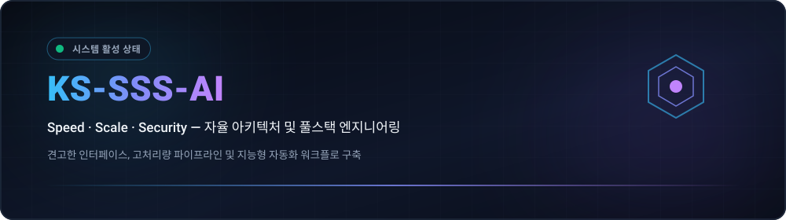
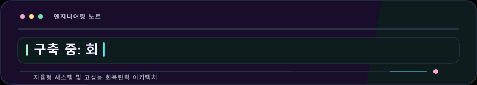
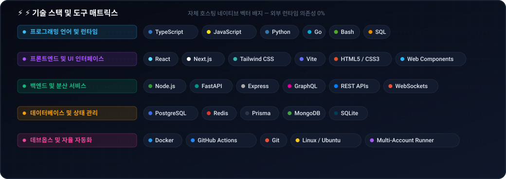
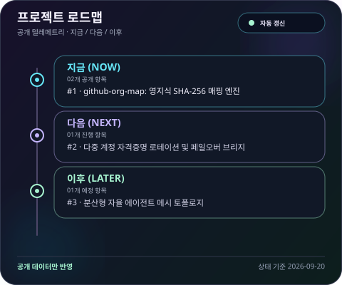
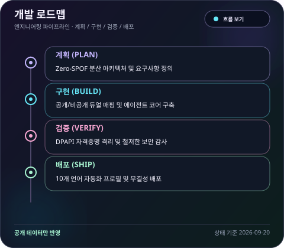
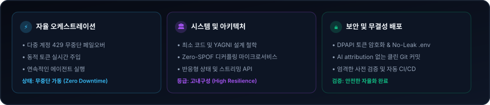

  <picture>
    <source media="(max-width: 840px)" srcset="../../assets/locales/ko/identity/hero-compact.svg" />
    
  </picture>
  <picture>
    
  </picture>

  <strong>Architecting Autonomous Systems, High-Performance Workflows &amp; Resilient Products.</strong> 
  Speed · Scale · Security — Engineering with clarity and conviction.

  <a href="../../../README.md">🇺🇸 English</a> · <strong>🇰🇷 한국어</strong> · <a href="./zh-CN.md">🇨🇳 中文</a> · <a href="./es.md">🇪🇸 Español</a> · <a href="./hi.md">🇮🇳 हिन्दी</a> 
  <a href="./ar.md">🇸🇦 العربية</a> · <a href="./pt-BR.md">🇧🇷 Português</a> · <a href="./ru.md">🇷🇺 Русский</a> · <a href="./fr.md">🇫🇷 Français</a> · <a href="./id.md">🇮🇩 Bahasa Indonesia</a>

  
  
  
  
  

---

<h2 style="display:inline-block; margin:0;">💡 핵심 철학 및 엔지니어링 지향점</h2>

견고한 소프트웨어 시스템, 지능형 자율 파이프라인 및 직관적인 인터페이스를 설계합니다. Triple-S 핵심 가치를 지향합니다:

  <picture>
    
  </picture>

- **⚡ Speed** — 군더더기 없는 최소 코드와 즉각적인 바이브 코딩으로 의도를 검증된 산출물로 신속히 변환합니다.
- **🏛️ Scale** — 클린 디커플링 아키텍처, 무상태 서비스, 단일장애점(Zero-SPOF) 없는 분산 토폴로지를 구축합니다.
- **🔒 Security** — 자격증명 격리, 무중단 쿼터 페일오버, 자동 보안 가드레일을 통해 신뢰성을 완벽 보장합니다.

  단단하게 만들고, 명확하게 유지하며, 불필요한 마찰을 자동화로 제거합니다.

---

<h2 style="display:inline-block; margin:0;">🚀 주요 프로젝트 및 솔루션</h2>

공개 프로젝트는 누구나 쉽게 살펴볼 수 있으며, 비공개 프로젝트는 안전하게 마스킹 처리됩니다. 조직 지도에서 비공개 저장소는 암호화된 해시 라벨로만 표시되며, 로드맵은 공개 텔레메트리를 바탕으로 자동 갱신됩니다.

### 주요 시스템 및 엔지니어링 솔루션

<table>
  <tr>
    <td width="50%" valign="top">
      

        
      

      <h4>🗺️ <a href="https://github.com/KS-SSS-AI/github-org-map">github-org-map</a></h4>
      
<em>KS-SSS-AI 계정 및 조직 저장소의 영지식(Zero-Knowledge) SHA-256 마스킹 기반 일일 자동화 지도 및 토폴로지 매핑.</em>

      

        
        
        
      

      <ul>
        <li><strong>🔄 무인 자동화</strong>: GitHub Actions 기반 매일 정기 스케줄 갱신 및 시크릿 유출 없는 격리 워크플로</li>
        <li><strong>🛡️ 프라이버시 보호</strong>: 비공개 저장소 식별자를 안전하게 마스킹 처리하여 전체 아키텍처만 공개</li>
        <li><strong>🎨 동적 시각화</strong>: 모든 조직 및 계정 단위 다이내믹 SVG 대시보드 및 움직이는 애니메이션 GIF 생성</li>
      </ul>
    </td>
    <td width="50%" valign="top">
      

        
      

      <h4>🔒 <a href="https://github.com/KS-SSS-AI/github-org-map-private">github-org-map-private</a></h4>
      
<em>내부 개발 및 지속적인 감사(Audit)를 위한 비공개 컴패니언 워크스페이스 및 언마스킹 텔레메트리 엔진.</em>

      

        
        
        
      

      <ul>
        <li><strong>🔐 듀얼 파이프라인</strong>: 공개용 마스킹 산출물과 함께 내부 관리용 언마스킹 토폴로지 뷰 병행 생성</li>
        <li><strong>⚡ Zero-SPOF 토폴로지</strong>: 다중 계정 자격증명 자동 로테이션 및 무중단 429 쿼터 페일오버</li>
        <li><strong>🏛️ 엄격한 기밀성</strong>: DPAPI 기반 자격증명 캡슐화 및 제로 유출 보안 가드레일 완벽 보장</li>
      </ul>
    </td>
  </tr>
</table>

  <a href="https://github.com/KS-SSS-AI?tab=repositories">공개 저장소 목록 보기</a> ·
  <a href="https://github.com/KS-SSS-AI/github-org-map">조직 지도 저장소 탐색</a>

---

<h2 style="display:inline-block; margin:0;">🚀 핵심 역량 및 아키텍처</h2>

<table>
  <tr>
    <td width="50%" valign="top">
      <h4>🤖 자율 에이전트 오케스트레이션</h4>
      
<em>지속적인 에이전트 워크플로, 툴 호출 런타임 및 다중 계정 자격증명 자동 로테이션.</em>

      <ul>
        <li><strong>쿼터 페일오버</strong>: 429 한도 도달 시 무중단 다중 계정 자동 전환 아키텍처 구축.</li>
        <li><strong>환경 격리 보장</strong>: 포터블 환경 스키마와 DPAPI 기반 자격증명 캡슐화로 유출 차단.</li>
        <li><strong>채팅 원격 제어</strong>: 디스코드 및 텔레그램을 로컬 에이전트 엔진과 연결하는 브릿지 제공.</li>
      </ul>
    </td>
    <td width="50%" valign="top">
      <h4>🌐 고가용성 풀스택 및 클라우드 시스템</h4>
      
<em>고처리량 백엔드 서비스와 결합된 반응형 고성능 인터페이스 구축.</em>

      <ul>
        <li><strong>프론트엔드 엔지니어링</strong>: React, Next.js, TypeScript 기반의 빠르고 접근성 높은 UI 설계.</li>
        <li><strong>마이크로서비스 및 API</strong>: Node.js, Python, Go 기반의 고동시성 비동기 백엔드 파이프라인.</li>
        <li><strong>코드형 인프라 (IaC)</strong>: GitHub Actions 자동화 CI/CD 및 Docker 컨테이너 무중단 배포.</li>
      </ul>
    </td>
  </tr>
</table>

---

<h2 style="display:inline-block; margin:0;">⚡ 기술 스택 및 도구 매트릭스</h2>

 

  <picture>
    
  </picture>

---

<h2 style="display:inline-block; margin:0;">🗺️ 프로젝트 및 로드맵 탐색</h2>

 

<strong>조직 토폴로지 지도 (Organization Map)</strong>

  <a href="https://github.com/KS-SSS-AI/github-org-map">
    <picture>
      
    </picture>
  </a>

비공개 저장소는 마스킹된 보안 라벨로만 표시됩니다.

<strong>프로젝트 로드맵</strong>

  <a href="https://github.com/issues?q=user%3AKS-SSS-AI+is%3Aissue+is%3Aopen">
    <picture>
      
    </picture>
  </a>

<strong>개발 파이프라인 로드맵</strong>

  <a href="https://github.com/issues?q=user%3AKS-SSS-AI+is%3Aissue">
    <picture>
      
    </picture>
  </a>

공개 GitHub 이슈 전용입니다. 공개 이슈에 roadmap:* 라벨과 stage:* 라벨을 부여하면 자동으로 연동됩니다.

---

<h2 style="display:inline-block; margin:0;">📊 아키텍처 대시보드 및 배포 지표</h2>

 

  <picture>
    
  </picture>

  <picture>
    
  </picture>

---

## 📬 협업 및 문의

자율 소프트웨어 아키텍처, 시스템 설계 및 엔지니어링 협업 논의를 환영합니다.

[GitHub Profile](https://github.com/KS-SSS-AI) · [Public Repositories](https://github.com/KS-SSS-AI?tab=repositories) · [Send an Email](mailto:youprodie@gmail.com)
