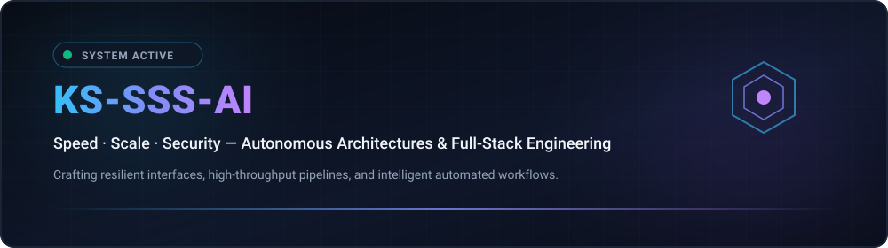

# 🇰🇷 KS-SSS-AI — 프로필 개요

  
  

---

### 💡 철학과 지향점 (Core Philosophy)

* **Speed (신속함)**: 군더더기 없는 최소 코드(Minimal Code), 즉각적인 프로토타이핑과 바이브 코딩으로 아이디어를 가장 빠른 경로로 실체화합니다.
* **Scale (확장성)**: 분산 아키텍처와 독립적 컴포넌트 설계를 통해 요구사항이 커져도 유지보수가 쉬운 견고한 시스템을 만듭니다.
* **Security (신뢰성 & 보안)**: 엄격한 가드레일, 자격증명 격리, 장애 복구(Failover) 매커니즘을 내재화하여 예외 상황에서도 안정성을 보장합니다.

---

### ⚡ 기술 스택 매트릭스 (Technology Stack)

  

---

### 📊 아키텍처 대시보드 및 파이프라인 (System Topology)

  

  

---

### 🚀 핵심 전문 영역 (Key Focus)

1. **자율 에이전트 & 바이브 코딩 파이프라인 (Autonomous Workflows)**
   - 대규모 LLM 에이전트 오케스트레이션, 툴 콜링(Tool-use), 멀티 세션 관리
   - 무중단 쿼터 페일오버 및 다중 자격증명 자동 로테이션 아키텍처
2. **풀스택 및 모던 웹 시스템 (Modern Full-Stack Engineering)**
   - React, Next.js, Node.js, TypeScript 기반의 반응형 고성능 인터페이스
   - 마이크로서비스 및 REST / GraphQL API 설계
3. **인프라 & 데브옵스 (Reliability & DevOps)**
   - Docker 컨테이너화, GitHub Actions CI/CD 자동화 파이프라인
   - 제로 다운타임 배포 및 자율 모니터링 환경 구축

[메인 영문 프로필로 돌아가기](../../../README.md)
