  <picture>
    
  </picture>
  <picture>
    
  </picture>

  <strong>Architecting Autonomous Systems, High-Performance Workflows &amp; Resilient Products.</strong> 
  Speed · Scale · Security — Engineering with clarity and conviction.

  <a href="../../../README.md">🇺🇸 English</a> · <a href="./ko.md">🇰🇷 한국어</a> · <a href="./zh-CN.md">🇨🇳 中文</a> · <a href="./es.md">🇪🇸 Español</a> · <a href="./hi.md">🇮🇳 हिन्दी</a> 
  <a href="./ar.md">🇸🇦 العربية</a> · <strong>🇧🇷 Português</strong> · <a href="./ru.md">🇷🇺 Русский</a> · <a href="./fr.md">🇫🇷 Français</a> · <a href="./id.md">🇮🇩 Bahasa Indonesia</a>

  
  
  
  

  

---

<h2 style="display:inline-block; margin:0;">💡 Sobre e Filosofia de Engenharia</h2>

Eu projeto e construo sistemas de software resilientes, pipelines autônomos inteligentes e interfaces focadas no usuário. Meu foco é o núcleo Triple-S:

- **⚡ Speed** — Prototipagem ágil, paradigmas de código mínimo e loops de agentes que convertem intenções em código validado.
- **🏛️ Scale** — Arquiteturas desacopladas limpas, serviços sem estado e topologias multi-nó sem ponto único de falha (Zero-SPOF).
- **🔒 Security** — Isolamento de credenciais Zero-Trust, roteamento de failover contínuo e proteções de segurança automatizadas.

  Torne-o resiliente. Mantenha-o claro. Automatize o atrito.

---

<h2 style="display:inline-block; margin:0;">🚀 Recursos e Arquiteturas em Destaque</h2>

<table>
  <tr>
    <td width="50%" valign="top">
      <h4>🤖 Orquestração de Agentes Autônomos</h4>
      
<em>Fluxos de trabalho contínuos de agentes de IA, execução de ferramentas e rotação de credenciais.</em>

      <ul>
        <li><strong>Failover de Cota</strong>: Rotação automática sem inatividade entre múltiplas contas sob limites de taxa (429).</li>
        <li><strong>Isolamento de Ambiente</strong>: Encapsulamento de credenciais via esquemas portáteis e proteção DPAPI.</li>
        <li><strong>Controle via Chat</strong>: Pontes remotas conectando Discord e Telegram a motores locais de agentes.</li>
      </ul>
    </td>
    <td width="50%" valign="top">
      <h4>🌐 Sistemas Resilientes Full-Stack e Cloud</h4>
      
<em>Aplicações web modernas interativas impulsionadas por serviços backend assíncronos de alta concorrência.</em>

      <ul>
        <li><strong>Engenharia Frontend</strong>: Interfaces acessíveis e de alta velocidade construídas com React, Next.js e TypeScript.</li>
        <li><strong>Microsserviços e APIs</strong>: Serviços assíncronos de alto desempenho implementados em Node.js, Python e Go.</li>
        <li><strong>Infraestrutura como Código</strong>: Pipelines CI/CD com GitHub Actions e containers Docker com zero inatividade.</li>
      </ul>
    </td>
  </tr>
</table>

---

<h2 style="display:inline-block; margin:0;">⚡ Stack Tecnológica e Ferramentas</h2>

 

  <picture>
    
  </picture>

---

<h2 style="display:inline-block; margin:0;">📊 Painel de Arquitetura e Métricas de Entrega</h2>

 

  <picture>
    
  </picture>

  <picture>
    
  </picture>

---

## 📬 Conectar e Colaborar

Interessado em discutir arquiteturas de software autônomas, colaboração técnica ou sistemas inovadores?

[GitHub Profile](https://github.com/KS-SSS-AI) · [Public Repositories](https://github.com/KS-SSS-AI?tab=repositories) · [Send an Email](mailto:youprodie@gmail.com)
