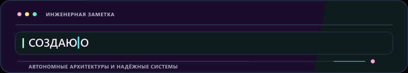
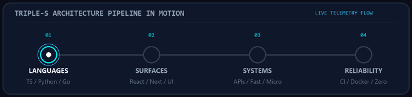
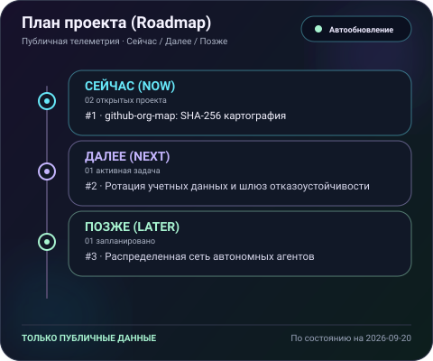
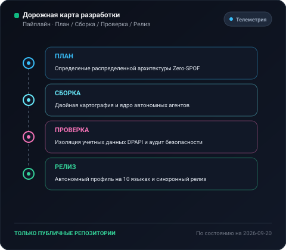

  <picture>
    <source media="(max-width: 840px)" srcset="../../assets/locales/ru/identity/hero-compact.svg" />
    
  </picture>
  <picture>
    
  </picture>

  <strong>Architecting Autonomous Systems, High-Performance Workflows &amp; Resilient Products.</strong> 
  Speed · Scale · Security — Engineering with clarity and conviction.

  <a href="../../../README.md">🇺🇸 English</a> · <a href="./ko.md">🇰🇷 한국어</a> · <a href="./zh-CN.md">🇨🇳 中文</a> · <a href="./es.md">🇪🇸 Español</a> · <a href="./hi.md">🇮🇳 हिन्दी</a> 
  <a href="./ar.md">🇸🇦 العربية</a> · <a href="./pt-BR.md">🇧🇷 Português</a> · <strong>🇷🇺 Русский</strong> · <a href="./fr.md">🇫🇷 Français</a> · <a href="./id.md">🇮🇩 Bahasa Indonesia</a>

  
  
  
  
  
  

---

<h2 style="display:inline-block; margin:0;">💡 Обо мне и принципы разработки</h2>

Я проектирую и создаю надежные программные системы, интеллектуальные автономные конвейеры и удобные интерфейсы. В основе лежит принцип Triple-S:

  <picture>
    
  </picture>

- **⚡ Speed** — Быстрое прототипирование, минимализм кода и автономные агенты, мгновенно переводящие замысел в готовый результат.
- **🏛️ Scale** — Чистая декомпозиция, сервисы без сохранения состояния и многоузловые топологии без единой точки отказа (Zero-SPOF).
- **🔒 Security** — Изоляция учетных данных Zero-Trust, автоматический отказоустойчивый роутинг и надежные защитные барьеры.

  Делай надежно. Сохраняй ясность. Автоматизируй рутину.

---

<h2 style="display:inline-block; margin:0;">🚀 Проекты и инженерные решения</h2>

Публичные репозитории открыты для изучения; приватные проекты защищены маскированием с нулевым разглашением. На карте организации закрытые репозитории отображаются только в виде зашифрованных меток.

### Ключевые системы и архитектурные решения

<table>
  <tr>
    <td width="50%" valign="top">
      

        
      

      <h4>🗺️ <a href="https://github.com/KS-SSS-AI/github-org-map">github-org-map</a></h4>
      
<em>Ежедневное автоматическое картографирование репозиториев с маскированием приватности на базе SHA-256.</em>

      

        
        
        
      

      <ul>
        <li><strong>🔄 Автоматизация</strong>: Ежедневный пайплайн GitHub Actions с нулевой утечкой токенов</li>
        <li><strong>🛡️ Конфиденциальность</strong>: Безопасное маскирование приватных имен с сохранением топологии</li>
        <li><strong>🎨 Визуализация</strong>: Динамические векторные дашборды SVG и генерация анимированных GIF</li>
      </ul>
    </td>
    <td width="50%" valign="top">
      

        
      

      <h4>🔒 <a href="https://github.com/KS-SSS-AI/github-org-map-private">github-org-map-private</a></h4>
      
<em>Приватное сопутствующее рабочее пространство и телеметрический движок для внутреннего аудита.</em>

      

        
        
        
      

      <ul>
        <li><strong>🔐 Двойной пайплайн</strong>: Параллельная генерация внутреннего немаскированного представления и публичных артефактов</li>
        <li><strong>⚡ Zero-SPOF топология</strong>: Ротация токенов между несколькими аккаунтами при лимитах 429</li>
        <li><strong>🏛️ Безопасность</strong>: Изоляция учетных данных с помощью DPAPI и гарантия отсутствия утечек</li>
      </ul>
    </td>
  </tr>
</table>

  <a href="https://github.com/KS-SSS-AI?tab=repositories">Публичные репозитории</a> ·
  <a href="https://github.com/KS-SSS-AI/github-org-map">Карта организации</a>

---

<h2 style="display:inline-block; margin:0;">🚀 Ключевые архитектурные решения</h2>

<table>
  <tr>
    <td width="50%" valign="top">
      <h4>🤖 Оркестрация автономных агентов</h4>
      
<em>Непрерывные рабочие процессы ИИ-агентов, запуск инструментов и автоматическая ротация токенов.</em>

      <ul>
        <li><strong>Отказоустойчивость квот</strong>: Автоматическая ротация нескольких аккаунтов без простоя при лимитах (429).</li>
        <li><strong>Изоляция окружения</strong>: Инкапсуляция учетных записей через портативные схемы и DPAPI-защиту.</li>
        <li><strong>Чат-управление</strong>: Мосты удаленного делегирования команд из Discord и Telegram к агентам.</li>
      </ul>
    </td>
    <td width="50%" valign="top">
      <h4>🌐 Надежные Full-Stack и облачные системы</h4>
      
<em>Современные интерактивные веб-приложения на базе высоконагруженных асинхронных сервисов.</em>

      <ul>
        <li><strong>Фронтенд-инженерия</strong>: Быстрые и доступные интерфейсы на базе React, Next.js и TypeScript.</li>
        <li><strong>Микросервисы и API</strong>: Высоконагруженные асинхронные сервисы на Node.js, Python и Go.</li>
        <li><strong>Инфраструктура как код</strong>: CI/CD на GitHub Actions, контейнеры Docker и бесшовное развертывание.</li>
      </ul>
    </td>
  </tr>
</table>

---

<h2 style="display:inline-block; margin:0;">⚡ Стек технологий и инструментарий</h2>

<em>Автономные векторные бейджи — 0% сторонних внешних зависимостей</em>

- **Languages &amp; Runtimes** — TypeScript, JavaScript, Python, Go, Bash, SQL, HTML5, CSS3
- **Surfaces &amp; Frontend** — React, Next.js, Vite, Tailwind CSS, Web Components
- **Microservices &amp; APIs** — Node.js, FastAPI, Express, GraphQL, REST APIs, WebSockets
- **Databases &amp; Caches** — PostgreSQL, Redis, Prisma, MongoDB, SQLite
- **Delivery &amp; Orchestration** — Docker, GitHub Actions, Linux / Ubuntu, Multi-Account Runner

<strong>Explore the visual stack &amp; live motion</strong>

 

<strong>Technical map</strong>

<picture>
  <source media="(max-width: 840px)" srcset="../../assets/locales/ru/visuals/technology-stack-compact.svg" />
  
</picture>

<strong>In motion</strong>

<picture>
  
</picture>

---

<h2 style="display:inline-block; margin:0;">🗺️ Топология проектов и дорожные карты</h2>

 

<strong>Карта организации и топология</strong>

  <a href="https://github.com/KS-SSS-AI/github-org-map">
    <picture>
      
    </picture>
  </a>

Приватные репозитории отображаются только в виде защищенных масок.

<strong>Дорожная карта проектов</strong>

  <a href="https://github.com/issues?q=user%3AKS-SSS-AI+is%3Aissue+is%3Aopen">
    <picture>
      
    </picture>
  </a>

<strong>Дорожная карта разработки</strong>

  <a href="https://github.com/issues?q=user%3AKS-SSS-AI+is%3Aissue">
    <picture>
      
    </picture>
  </a>

Используются только публичные задачи GitHub. Добавьте метку roadmap:* и stage:*, чтобы задача отображалась здесь.

---

<h2 style="display:inline-block; margin:0;">📊 Панель архитектуры и метрики надежности</h2>

 

  <picture>
    <source media="(max-width: 840px)" srcset="../../assets/locales/ru/visuals/architecture-metrics-compact.svg" />
    
  </picture>

  <picture>
    <source media="(max-width: 840px)" srcset="../../assets/locales/ru/visuals/workflow-pipeline-compact.svg" />
    
  </picture>

  <a href="../../docs/architecture.md">📖 Explore Full Architecture Specification &amp; Governance</a>

---

## 📬 Контакты и сотрудничество

Заинтересованы в обсуждении автономных архитектур, инженерном партнерстве или инновационных решениях?

[GitHub Profile](https://github.com/KS-SSS-AI) · [Public Repositories](https://github.com/KS-SSS-AI?tab=repositories) · [Roadmap Tracker](https://github.com/issues?q=user%3AKS-SSS-AI+is%3Aissue+is%3Aopen) · [Architecture Guide](../../docs/architecture.md) · [Send an Email](mailto:youprodie@gmail.com)
