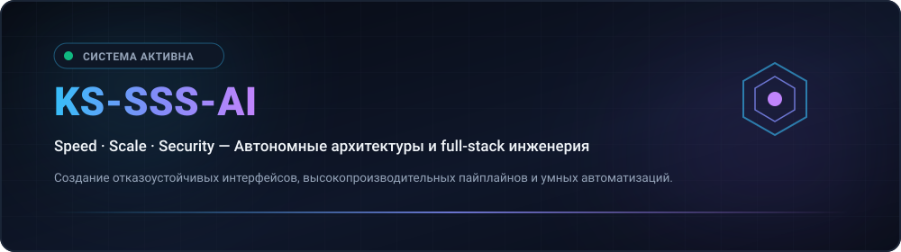
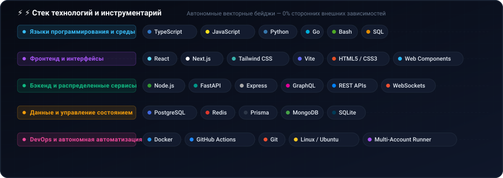
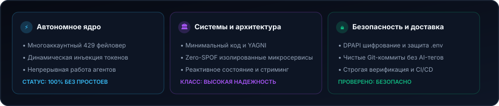

  <picture>
    
  </picture>
  <picture>
    
  </picture>

  <strong>Architecting Autonomous Systems, High-Performance Workflows &amp; Resilient Products.</strong> 
  Speed · Scale · Security — Engineering with clarity and conviction.

  <a href="../../../README.md">🇺🇸 English</a> · <a href="./ko.md">🇰🇷 한국어</a> · <a href="./zh-CN.md">🇨🇳 中文</a> · <a href="./es.md">🇪🇸 Español</a> · <a href="./hi.md">🇮🇳 हिन्दी</a> 
  <a href="./ar.md">🇸🇦 العربية</a> · <a href="./pt-BR.md">🇧🇷 Português</a> · <strong>🇷🇺 Русский</strong> · <a href="./fr.md">🇫🇷 Français</a> · <a href="./id.md">🇮🇩 Bahasa Indonesia</a>

  
  
  
  

  

---

<h2 style="display:inline-block; margin:0;">💡 Обо мне и принципы разработки</h2>

Я проектирую и создаю надежные программные системы, интеллектуальные автономные конвейеры и удобные интерфейсы. В основе лежит принцип Triple-S:

- **⚡ Speed** — Быстрое прототипирование, минимализм кода и автономные агенты, мгновенно переводящие замысел в готовый результат.
- **🏛️ Scale** — Чистая декомпозиция, сервисы без сохранения состояния и многоузловые топологии без единой точки отказа (Zero-SPOF).
- **🔒 Security** — Изоляция учетных данных Zero-Trust, автоматический отказоустойчивый роутинг и надежные защитные барьеры.

  Делай надежно. Сохраняй ясность. Автоматизируй рутину.

---

<h2 style="display:inline-block; margin:0;">🚀 Ключевые архитектурные решения</h2>

<table>
  <tr>
    <td width="50%" valign="top">
      <h4>🤖 Оркестрация автономных агентов</h4>
      
<em>Непрерывные рабочие процессы ИИ-агентов, запуск инструментов и автоматическая ротация токенов.</em>

      <ul>
        <li><strong>Отказоустойчивость квот</strong>: Автоматическая ротация нескольких аккаунтов без простоя при лимитах (429).</li>
        <li><strong>Изоляция окружения</strong>: Инкапсуляция учетных записей через портативные схемы и DPAPI-защиту.</li>
        <li><strong>Чат-управление</strong>: Мосты удаленного делегирования команд из Discord и Telegram к агентам.</li>
      </ul>
    </td>
    <td width="50%" valign="top">
      <h4>🌐 Надежные Full-Stack и облачные системы</h4>
      
<em>Современные интерактивные веб-приложения на базе высоконагруженных асинхронных сервисов.</em>

      <ul>
        <li><strong>Фронтенд-инженерия</strong>: Быстрые и доступные интерфейсы на базе React, Next.js и TypeScript.</li>
        <li><strong>Микросервисы и API</strong>: Высоконагруженные асинхронные сервисы на Node.js, Python и Go.</li>
        <li><strong>Инфраструктура как код</strong>: CI/CD на GitHub Actions, контейнеры Docker и бесшовное развертывание.</li>
      </ul>
    </td>
  </tr>
</table>

---

<h2 style="display:inline-block; margin:0;">⚡ Стек технологий и инструментарий</h2>

 

  <picture>
    
  </picture>

---

<h2 style="display:inline-block; margin:0;">📊 Панель архитектуры и метрики надежности</h2>

 

  <picture>
    
  </picture>

  <picture>
    
  </picture>

---

## 📬 Контакты и сотрудничество

Заинтересованы в обсуждении автономных архитектур, инженерном партнерстве или инновационных решениях?

[GitHub Profile](https://github.com/KS-SSS-AI) · [Public Repositories](https://github.com/KS-SSS-AI?tab=repositories) · [Send an Email](mailto:youprodie@gmail.com)
