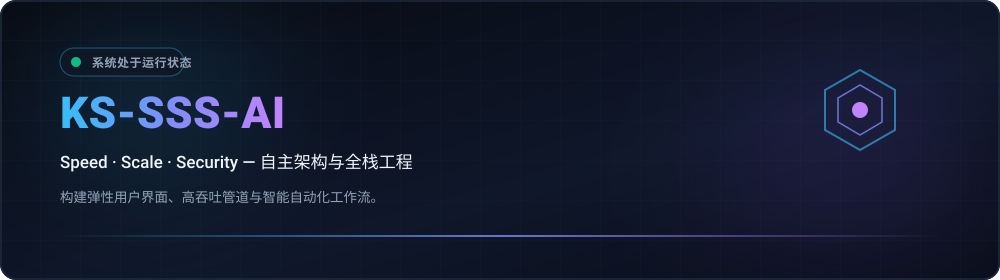

  <picture>
    
  </picture>
  <picture>
    
  </picture>

  <strong>Architecting Autonomous Systems, High-Performance Workflows &amp; Resilient Products.</strong> 
  Speed · Scale · Security — Engineering with clarity and conviction.

  <a href="../../../README.md">🇺🇸 English</a> · <a href="./ko.md">🇰🇷 한국어</a> · <strong>🇨🇳 中文</strong> · <a href="./es.md">🇪🇸 Español</a> · <a href="./hi.md">🇮🇳 हिन्दी</a> 
  <a href="./ar.md">🇸🇦 العربية</a> · <a href="./pt-BR.md">🇧🇷 Português</a> · <a href="./ru.md">🇷🇺 Русский</a> · <a href="./fr.md">🇫🇷 Français</a> · <a href="./id.md">🇮🇩 Bahasa Indonesia</a>

  
  
  
  

  

---

<h2 style="display:inline-block; margin:0;">💡 核心理念与工程哲学</h2>

我设计并构建高韧性软件系统、智能自动化工作流与以用户为中心的高性能交互界面。以 Triple-S 为核心：

- **⚡ Speed** — 零阻力原型设计与最小代码原则，将工程意图即时转化为经过验证的交付物。
- **🏛️ Scale** — 解耦架构、无状态服务与无单点故障（Zero-SPOF）的多节点分布式拓扑。
- **🔒 Security** — 凭据隔离、持续配额故障转移路由以及保障极致可靠性的自动化安全护栏。

  保持韧性，保持清晰，以自动化消除一切繁杂。

---

<h2 style="display:inline-block; margin:0;">🚀 核心能力与系统架构</h2>

<table>
  <tr>
    <td width="50%" valign="top">
      <h4>🤖 自主智能体编排</h4>
      
<em>持续的 AI 代理工作流、工具调用运行时与多凭据令牌无缝轮换。</em>

      <ul>
        <li><strong>Quota Failover</strong>: Zero-downtime automatic rotation across multiple accounts upon rate limit (429) triggers.</li>
        <li><strong>Environment Isolation</strong>: Credential encapsulation via portable environment schemas and DPAPI-level guardrails.</li>
        <li><strong>Chat-Driven Control</strong>: Remote command delegation bridges connecting Discord and Telegram to local agent engines.</li>
      </ul>
    </td>
    <td width="50%" valign="top">
      <h4>🌐 弹性全栈与云原生系统</h4>
      
<em>由高并发异步后端驱动的现代敏捷 Web 应用程序。</em>

      <ul>
        <li><strong>Frontend Engineering</strong>: Fast, accessible client interfaces built with React, Next.js, and TypeScript.</li>
        <li><strong>Microservices &amp; APIs</strong>: High-concurrency asynchronous backends utilizing Node.js, Python, and Go.</li>
        <li><strong>Infrastructure as Code</strong>: Automated CI/CD pipelines, Docker containerization, and cloud deployment targets.</li>
      </ul>
    </td>
  </tr>
</table>

---

<h2 style="display:inline-block; margin:0;">⚡ 技术栈与工具矩阵</h2>

 

  <picture>
    
  </picture>

---

<h2 style="display:inline-block; margin:0;">📊 架构仪表板与交付指标</h2>

 

  <picture>
    
  </picture>

  <picture>
    
  </picture>

---

## 📬 联系与合作

欢迎探讨自主软件架构、工程协同与创新系统设计。

[GitHub Profile](https://github.com/KS-SSS-AI) · [Public Repositories](https://github.com/KS-SSS-AI?tab=repositories) · [Send an Email](mailto:youprodie@gmail.com)
