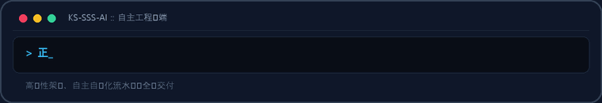
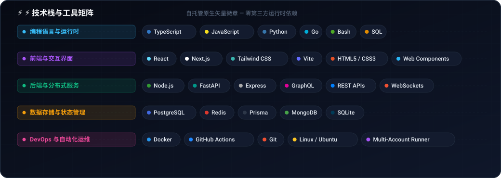
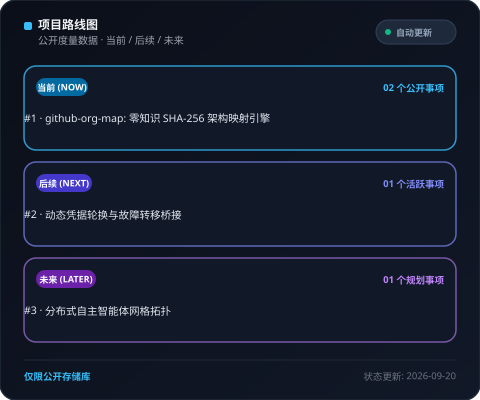
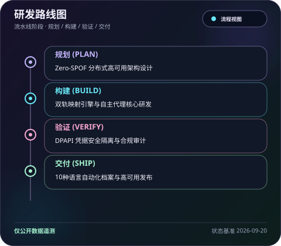

  <picture>
    <source media="(max-width: 840px)" srcset="../../assets/locales/zh-CN/identity/hero-compact.svg" />
    
  </picture>
  <picture>
    
  </picture>

  <strong>Architecting Autonomous Systems, High-Performance Workflows &amp; Resilient Products.</strong> 
  Speed · Scale · Security — Engineering with clarity and conviction.

  <a href="../../../README.md">🇺🇸 English</a> · <a href="./ko.md">🇰🇷 한국어</a> · <strong>🇨🇳 中文</strong> · <a href="./es.md">🇪🇸 Español</a> · <a href="./hi.md">🇮🇳 हिन्दी</a> 
  <a href="./ar.md">🇸🇦 العربية</a> · <a href="./pt-BR.md">🇧🇷 Português</a> · <a href="./ru.md">🇷🇺 Русский</a> · <a href="./fr.md">🇫🇷 Français</a> · <a href="./id.md">🇮🇩 Bahasa Indonesia</a>

  
  
  
  
  
  

---

<h2 style="display:inline-block; margin:0;">💡 核心理念与工程哲学</h2>

我设计并构建高韧性软件系统、智能自动化工作流与以用户为中心的高性能交互界面。以 Triple-S 为核心：

  <picture>
    
  </picture>

- **⚡ Speed** — 零阻力原型设计与最小代码原则，将工程意图即时转化为经过验证的交付物。
- **🏛️ Scale** — 解耦架构、无状态服务与无单点故障（Zero-SPOF）的多节点分布式拓扑。
- **🔒 Security** — 凭据隔离、持续配额故障转移路由以及保障极致可靠性的自动化安全护栏。

  保持韧性，保持清晰，以自动化消除一切繁杂。

---

<h2 style="display:inline-block; margin:0;">🚀 核心项目与架构方案</h2>

公开项目便于直观查阅，私有项目则经过严格的零知识隐私掩码保护。组织图谱中的私有仓库仅显示为经过加盐哈希的标识，整体架构保持透明与安全。

### 精选系统与工程解决方案

<table>
  <tr>
    <td width="50%" valign="top">
      

        
      

      <h4>🗺️ <a href="https://github.com/KS-SSS-AI/github-org-map">github-org-map</a></h4>
      
<em>基于零知识 SHA-256 掩码的 KS-SSS-AI 仓库拓扑与组织图谱自动日常生成系统。</em>

      

        
        
        
      

      <ul>
        <li><strong>🔄 持续自动化</strong>: 基于 GitHub Actions 的定时每日构建与零凭据泄漏的安全工作流</li>
        <li><strong>🛡️ 隐私安全</strong>: 自动掩码私有存储库标识符，在展示宏观架构的同时严防敏感信息外泄</li>
        <li><strong>🎨 矢量可视化</strong>: 跨账户动态矢量 SVG 仪表板与高帧率动图 GIF 自动生成</li>
      </ul>
    </td>
    <td width="50%" valign="top">
      

        
      

      <h4>🔒 <a href="https://github.com/KS-SSS-AI/github-org-map-private">github-org-map-private</a></h4>
      
<em>用于内部敏捷研发与持续审计的私有伴随工作区及未掩码拓扑度量引擎。</em>

      

        
        
        
      

      <ul>
        <li><strong>🔐 双重流水线</strong>: 在发布公开掩码制品的同时并行生成内部精细拓扑图谱</li>
        <li><strong>⚡ 高可用拓扑</strong>: 多账户凭据动态注入与 429 限流零停机无缝故障转移</li>
        <li><strong>🏛️ 凭据隔离</strong>: DPAPI 级别加密隔离与严苛的零泄漏自动化防护保障</li>
      </ul>
    </td>
  </tr>
</table>

  <a href="https://github.com/KS-SSS-AI?tab=repositories">浏览公开仓库列表</a> ·
  <a href="https://github.com/KS-SSS-AI/github-org-map">访问组织地图仓库</a>

---

<h2 style="display:inline-block; margin:0;">🚀 核心能力与系统架构</h2>

<table>
  <tr>
    <td width="50%" valign="top">
      <h4>🤖 自主智能体编排</h4>
      
<em>持续的 AI 代理工作流、工具调用运行时与多凭据令牌无缝轮换。</em>

      <ul>
        <li><strong>配额故障转移</strong>: 达到 429 速率限制时实现多账户零停机自动无缝轮换。</li>
        <li><strong>环境安全隔离</strong>: 便携式环境模式与 DPAPI 凭据封装，杜绝敏感泄露。</li>
        <li><strong>聊天驱动控制</strong>: 通过 Discord 与 Telegram 连接本地智能体引擎的远程委托桥梁。</li>
      </ul>
    </td>
    <td width="50%" valign="top">
      <h4>🌐 弹性全栈与云原生系统</h4>
      
<em>由高并发异步后端驱动的现代敏捷 Web 应用程序。</em>

      <ul>
        <li><strong>前端工程设计</strong>: 基于 React、Next.js 与 TypeScript 构建的高效无障碍界面。</li>
        <li><strong>微服务与接口</strong>: 基于 Node.js、Python 与 Go 的高并发异步后端服务管道。</li>
        <li><strong>基础设施即代码</strong>: GitHub Actions 持续交付流水线与 Docker 容器化零停机部署。</li>
      </ul>
    </td>
  </tr>
</table>

---

<h2 style="display:inline-block; margin:0;">⚡ 技术栈与工具矩阵</h2>

<em>自托管原生矢量徽章 — 零第三方运行时依赖</em>

- **Languages &amp; Runtimes** — TypeScript, JavaScript, Python, Go, Bash, SQL, HTML5, CSS3
- **Surfaces &amp; Frontend** — React, Next.js, Vite, Tailwind CSS, Web Components
- **Microservices &amp; APIs** — Node.js, FastAPI, Express, GraphQL, REST APIs, WebSockets
- **Databases &amp; Caches** — PostgreSQL, Redis, Prisma, MongoDB, SQLite
- **Delivery &amp; Orchestration** — Docker, GitHub Actions, Linux / Ubuntu, Multi-Account Runner

<strong>Explore the visual stack &amp; live motion</strong>

 

<strong>Technical map</strong>

<picture>
  <source media="(max-width: 840px)" srcset="../../assets/locales/zh-CN/visuals/technology-stack-compact.svg" />
  
</picture>

<strong>In motion</strong>

<picture>
  
</picture>

---

<h2 style="display:inline-block; margin:0;">🗺️ 项目拓扑与路线图探索</h2>

 

<strong>组织架构全景地图</strong>

  <a href="https://github.com/KS-SSS-AI/github-org-map">
    <picture>
      
    </picture>
  </a>

私有仓库仅以安全掩码标签形式呈现。

<strong>undefined</strong>

  <a href="https://github.com/issues?q=user%3AKS-SSS-AI+is%3Aissue+is%3Aopen">
    <picture>
      
    </picture>
  </a>

<strong>undefined</strong>

  <a href="https://github.com/issues?q=user%3AKS-SSS-AI+is%3Aissue">
    <picture>
      
    </picture>
  </a>

undefined

---

<h2 style="display:inline-block; margin:0;">📊 架构仪表板与交付指标</h2>

 

  <picture>
    <source media="(max-width: 840px)" srcset="../../assets/locales/zh-CN/visuals/architecture-metrics-compact.svg" />
    
  </picture>

  <picture>
    <source media="(max-width: 840px)" srcset="../../assets/locales/zh-CN/visuals/workflow-pipeline-compact.svg" />
    
  </picture>

  <a href="../../docs/architecture.md">📖 Explore Full Architecture Specification &amp; Governance</a>

---

## 📬 联系与合作

欢迎探讨自主软件架构、工程协同与创新系统设计。

[GitHub Profile](https://github.com/KS-SSS-AI) · [Public Repositories](https://github.com/KS-SSS-AI?tab=repositories) · [Roadmap Tracker](https://github.com/issues?q=user%3AKS-SSS-AI+is%3Aissue+is%3Aopen) · [Architecture Guide](../../docs/architecture.md) · [Send an Email](mailto:youprodie@gmail.com)
