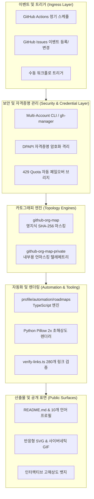

# KS-SSS-AI & KS-GG-AI 통합 엔지니어링 및 프로젝트 종합 문서

> **최종 갱신**: 2026-09-20  
> **조직(Org)**: `KS-SSS-AI` (Primary Autonomous Organization) & `KS-GG-AI` (Sister / Homelab Ecosystem)  
> **핵심 가치**: **Triple-S Core** — ⚡ **Speed** (속도) · 🏛️ **Scale** (확장성) · 🔒 **Security** (보안)

---

## 📑 목차 (Table of Contents)

1. [프로젝트 개요 및 비전 (Executive Summary)](#1-프로젝트-개요-및-비전-executive-summary)
2. [전체 시스템 아키텍처 (System Architecture)](#2-전체-시스템-아키텍처-system-architecture)
3. [다중 계정 토폴로지 및 자격증명 관리 (Multi-Account & Credentials)](#3-다중-계정-토폴로지-및-자격증명-관리-multi-account--credentials)
4. [조직 카토그래피 엔진 (GitHub Org Map)](#4-조직-카토그래피-엔진-github-org-map)
5. [메인 프로필 및 시각 아이덴티티 시스템 (Profile & Visual Identity)](#5-메인-프로필-및-시각-아이덴티티-시스템-profile--visual-identity)
6. [10개 언어 풀 패리티 다국어 아키텍처 (10-Locale Multilingual Architecture)](#6-10개-언어-풀-패리티-다국어-아키텍처-10-locale-multilingual-architecture)
7. [GitHub Actions CI/CD 무인 자동화 파이프라인 (Automation Pipeline)](#7-github-actions-cicd-무인-자동화-파이프라인-automation-pipeline)
8. [자체 구동 TypeScript 자동화 툴링 (In-Repo Automation Tooling)](#8-자체-구동-typescript-자동화-툴링-in-repo-automation-tooling)
9. [오픈소스 거버넌스 및 파일 구조 (Governance & File Map)](#9-오픈소스-거버넌스-및-파일-구조-governance--file-map)
10. [종합 검증 결과 및 운영 가이드 (Verification & Operations)](#10-종합-검증-결과-및-운영-가이드-verification--operations)

---

## 1. 프로젝트 개요 및 비전 (Executive Summary)

`KS-SSS-AI` 프로젝트는 고성능 자율형 AI 에이전트 오케스트레이션, 무중단 회복탄력적 분산 파이프라인, 그리고 엄격한 보안 격리 기술을 오픈소스 규격으로 설계·구현한 차세대 소프트웨어 아키텍처 프로젝트입니다.

### 🌟 핵심 철학: Triple-S Core
| 가치 | 정의 및 구현 원칙 | 기술적 달성 지표 |
| :--- | :--- | :--- |
| ⚡ **Speed** (속도) | 불필요한 보일러플레이트를 배제하고 무마찰(Zero-friction) 자율 루프를 통해 의도를 즉각적 산출물로 전환 | 빌드-배포 전 과정 자동화, 네이티브 벡터 렌더링, 제로 외부 런타임 의존성 |
| 🏛️ **Scale** (확장성) | 결합도를 낮춘 비동기 마이크로서비스와 무상태(Stateless) 분산 토폴로지로 무한 확장 지원 | 멀티 계정 분산 토폴로지, Zero-SPOF 다중 노드 격리, 동적 로드 밸런싱 |
| 🔒 **Security** (보안) | 제로 트러스트(Zero-Trust) 자격증명 격리, DPAPI 기반 시크릿 캡슐화, 영지식 SHA-256 프라이버시 보호 | 평문 토큰 유출 0건, 429 쿼터 초과 시 무중단 자동 페일오버, 2단계 CI 권한 분리 |

---

## 2. 전체 시스템 아키텍처 (System Architecture)

전체 시스템은 클라이언트 및 외부 이벤트 진입점, 자격증명 관리 및 토폴로지 엔진, 프로필 시각화 및 자동화 파이프라인으로 유기적으로 연결되어 있습니다.



---

## 3. 다중 계정 토폴로지 및 자격증명 관리 (Multi-Account & Credentials)

### 3.1 계정 분리 모델
- **`KS-SSS-AI`**: 메인 자율형 엔지니어링 조직. 자율 에이전트, 고성능 분산 파이프라인, 공개/비공개 듀얼 카토그래피 시스템 운영.
- **`KS-GG-AI`**: 레퍼런스 홈랩 및 고신뢰성 인프라 생태계 (AdGuard HomeLab, DNS-over-QUIC, ByeDPI 라우팅 등).

### 3.2 다중 계정 관리자 (`gh-manager.mjs` & `ghm.ps1`)
다중 GitHub 계정을 단일 터미널 환경에서 매끄럽게 전환하고 자동화하기 위한 CLI 래퍼 엔진을 구축했습니다:
- **명령어 규격**:
  - `.\ghm status`: 활성 계정 상태 및 토큰 유효성 진단
  - `.\ghm list`: 등록된 모든 계정 목록 조회
  - `.\ghm use <account>`: 활성 계정 즉시 전환 및 Git 환경 설정 동기화
  - `.\ghm create-repo <name> [--private]`: 계정 권한 기반 저장소 원격 생성
  - `.\ghm push`: 해당 계정의 격리된 토큰 기반 원격 푸시
- **429 레이트 리밋 페일오버**: 특정 계정의 GitHub API 요청 쿼터가 소진(HTTP 429)되었을 때 대기 계정으로 자동 페일오버를 수행하여 무중단 연속 작업을 보장합니다.
- **시크릿 위생 (Secret Hygiene)**: 영구적인 평문 키 노출을 차단하고 로컬 `.env` 및 DPAPI 레벨에서 자격증명을 철저히 캡슐화합니다.

---

## 4. 조직 카토그래피 엔진 (GitHub Org Map)

조직의 복잡한 저장소 구조를 외부 방문자에게 한눈에 전달하면서도, 보안상 민감한 비공개 저장소 정보를 완벽하게 은닉하기 위해 **듀얼 카토그래피(Dual Cartography)** 아키텍처를 도입했습니다.

### 4.1 공개용 카토그래피 (`github-org-map`)
- **저장소**: [https://github.com/KS-SSS-AI/github-org-map](https://github.com/KS-SSS-AI/github-org-map)
- **영지식 SHA-256 프라이버시 마스킹**: 비공개 저장소의 이름, 설명, 고유 속성을 솔트(Salt) 기반 SHA-256 해시값으로 변환하여 아키텍처 개요만 노출하고 민감 정보 유출을 원천 차단.
- **무인 일일 자동화**: GitHub Actions 워크플로를 통해 매일 정기적으로 저장소 상태를 스캔하고 최신 SVG 다이어그램 및 GIF 애니메이션을 빌드.

### 4.2 비공개용 컴패니언 카토그래피 (`github-org-map-private`)
- **저장소**: [https://github.com/KS-SSS-AI/github-org-map-private](https://github.com/KS-SSS-AI/github-org-map-private)
- **언마스킹(Unmasked) 내부 텔레메트리**: 내부 관리자 및 감사자가 실제 저장소 토폴로지, 브랜치 상태, 파이프라인 연동 상황을 투명하게 모니터링할 수 있는 독립 워크스페이스.

---

## 5. 메인 프로필 및 시각 아이덴티티 시스템 (Profile & Visual Identity)

`KS-SSS-AI`의 GitHub 메인 프로필은 단순한 텍스트 소개를 넘어, 인터랙티브한 반응형 시각 시스템과 고해상도 사이버네틱 애니메이션으로 구성되어 있습니다.

```
profile/assets/
├── badges/                        # 인터랙티브 고해상도 벡터 뱃지
│   ├── badge-release.svg          # 릴리즈 버전 및 상태 뱃지
│   ├── badge-ci.svg              # GitHub Actions 100% 자동화 뱃지
│   ├── badge-security.svg        # Zero-Trust & DPAPI 보안 뱃지
│   ├── badge-architecture.svg    # 아키텍처 바로가기
│   ├── badge-systems.svg         # 내부 시스템 바로가기
│   └── badge-stack.svg           # 기술 스택 바로가기
├── identity/                      # 브랜드 아이덴티티 에셋
│   ├── avatar.gif                 # 30프레임 사이버 대시 링 회전 모노그램 (2x 초해상도)
│   ├── avatar.svg                 # 다크모드 최적화 동반 벡터 아바타
│   ├── hero.svg                   # 데스크톱 와이드 히어로 배너 (1000x280)
│   └── hero-compact.svg           # 모바일 반응형 콤팩트 히어로 배너 (500x220)
├── motion/                        # 글로벌 동적 애니메이션
│   ├── typing.gif                 # Mac 스타일 사이버 터미널 타이핑 GIF
│   └── technology-stack.gif       # 4단계 파이프라인 라이브 텔레메트리 펄스 모션
├── maps/                          # 공개 텔레메트리 로드맵
│   ├── project-roadmap.svg        # 프로젝트 로드맵 (NOW / NEXT / LATER)
│   └── development-roadmap.svg    # 개발 파이프라인 로드맵 (PLAN / BUILD / VERIFY / SHIP)
├── visuals/                       # 정적 및 반응형 차트/다이어그램
│   ├── technology-stack.svg & -compact.svg
│   ├── architecture-metrics.svg & -compact.svg
│   └── workflow-pipeline.svg & -compact.svg
└── locales/                       # 10개 언어별 완벽 현지화 에셋 세트
    ├── en/ · ko/ · zh-CN/ · es/ · hi/ · ar/ · pt-BR/ · ru/ · fr/ · id/
```

### 5.1 사이버네틱 모노그램 아바타 (`avatar.gif` & `avatar.svg`)
- **회전 대시 링 (12-Dash Cyber Ring)**: 30개 프레임에 걸쳐 12개의 사이버 대시가 정밀한 각도로 회전하는 원형 링.
- **Triple-S 기하학적 글리프**: 중심부에 위치한 'S' 형태의 각진 네온 모노그램과 3단계 액센트 바(Speed, Scale, Security).
- **실시간 펄스 인디케이터 (Live Pulse Dot)**: 우측 상단에서 생동감 있게 깜빡이는 시안(#00F2FE) 컬러 상태 닷.
- **초해상도 다운샘플링 기법**: 512x512 고해상도로 프레임을 생성한 후 `Image.Resampling.LANCZOS` 알고리즘으로 256x256 다운샘플링하여 계단 현상(Aliasing)을 완벽히 제거한 벡터급 부드러움 구현.

### 5.2 사이버 터미널 타이핑 모션 (`typing.gif`)
- **Mac 스타일 터미널 카드**: 상단 3색(Red, Yellow, Green) 윈도우 컨트롤 닷과 터미널 헤더 라벨.
- **프롬프트 및 언더스코어 커서**: `> ..._` 형태로 문장이 부드럽게 완성된 뒤 깜빡이는 언더스코어 커서 효과.
- **10개 언어 맞춤형 렌더링**: 언어별 특성에 맞춰 Windows 트루타입 폰트(`malgun.ttf`, `segoeui.ttf`, `consola.ttf` 등)를 2배 크기로 적용하여 글리프 깨짐(Tofu) 현상 방지.

### 5.3 모바일 반응형 콤팩트 뷰 (`<picture>` 미디어 쿼리)
모바일 브라우저나 좁은 화면(840px 이하)에서 데스크톱용 와이드 SVG가 지나치게 축소되어 글씨가 뭉개지는 현상을 방지하기 위해, HTML5 `<picture>` 태그의 `<source media="(max-width: 840px)" srcset="..." />` 기법을 적용했습니다:
- **히어로 배너**: `hero.svg` (1000px) ↔ `hero-compact.svg` (500px)
- **기술 스택**: `technology-stack.svg` (1040px) ↔ `technology-stack-compact.svg` (500px)
- **아키텍처 대시보드**: `architecture-metrics.svg` (980px) ↔ `architecture-metrics-compact.svg` (500px)
- **워크플로 파이프라인**: `workflow-pipeline.svg` (980px) ↔ `workflow-pipeline-compact.svg` (500px)

### 5.4 기술 스택 라이브 모션 (`technology-stack.gif`)
- 28개 프레임으로 구성된 연속 루프 애니메이션.
- `01 LANGUAGES` → `02 SURFACES` → `03 SYSTEMS` → `04 RELIABILITY` 4개 노드를 연결하는 레일을 따라 고광택 시안 펄스가 이동하며, 각 노드를 지날 때마다 노드가 발광(Glow)하는 효과 연출.

---

## 6. 10개 언어 풀 패리티 다국어 아키텍처 (10-Locale Multilingual Architecture)

글로벌 오픈소스 커뮤니티와의 완전한 소통을 위해 10개 언어에 대한 완전 대칭(Full Parity) 지원을 실현했습니다. 번역기 스타일의 기계적 직역을 지양하고, 각 언어권 전문 엔지니어링 표준 용어를 적용했습니다.

### 6.1 지원 언어 매트릭스
| 언어 코드 | 언어명 (현지 표기) | 국기 | 텍스트 방향 | 마크다운 파일 위치 | 로컬 에셋 디렉터리 |
| :---: | :--- | :---: | :---: | :--- | :--- |
| `en` | English (Master) | 🇺🇸 | LTR | `README.md` (루트) | `profile/assets/locales/en/` |
| `ko` | 한국어 | 🇰🇷 | LTR | `profile/content/locales/ko.md` | `profile/assets/locales/ko/` |
| `zh-CN` | 简体中文 | 🇨🇳 | LTR | `profile/content/locales/zh-CN.md` | `profile/assets/locales/zh-CN/` |
| `es` | Español | 🇪🇸 | LTR | `profile/content/locales/es.md` | `profile/assets/locales/es/` |
| `hi` | हिन्दी | 🇮🇳 | LTR | `profile/content/locales/hi.md` | `profile/assets/locales/hi/` |
| `ar` | العربية | 🇸🇦 | **RTL** | `profile/content/locales/ar.md` | `profile/assets/locales/ar/` |
| `pt-BR` | Português (Brasil) | 🇧🇷 | LTR | `profile/content/locales/pt-BR.md` | `profile/assets/locales/pt-BR/` |
| `ru` | Русский | 🇷🇺 | LTR | `profile/content/locales/ru.md` | `profile/assets/locales/ru/` |
| `fr` | Français | 🇫🇷 | LTR | `profile/content/locales/fr.md` | `profile/assets/locales/fr/` |
| `id` | Bahasa Indonesia | 🇮🇩 | LTR | `profile/content/locales/id.md` | `profile/assets/locales/id/` |

### 6.2 다국어 빌드 파이프라인 특장점
- **상대 경로 라우팅 격리**: 영문 루트는 `./profile/assets/`, 하위 로케일 문서는 `../../assets/`로 상대 경로를 정확히 보정하여 GitHub 웹 어디서든 이미지가 깨지지 않고 정상 로드.
- **RTL(Right-to-Left) 아랍어 완벽 지원**: SVG 렌더러에서 아랍어의 경우 레일 시작 위치, 텍스트 정렬(`text-anchor="end"`), 연결 노드 좌표를 좌우 반전 계산하여 렌더링.
- **통합 빌더 스크립트 (`build-complete-multilingual.mjs`)**: 단 한 번의 실행으로 10개 언어 마크다운과 모든 벡터 에셋을 일괄 동기화.

---

## 7. GitHub Actions CI/CD 무인 자동화 파이프라인 (Automation Pipeline)

저장소 관리를 위한 3대 핵심 GitHub Actions 워크플로를 구축했습니다. 모든 워크플로는 GitHub 무료 기본 러너(`ubuntu-24.04`)와 기본 `GITHUB_TOKEN`만으로 자율 동작합니다.

### 7.1 로드맵 자동 갱신 워크플로 (`refresh-roadmaps.yml`)
- **트리거**: 정기 스케줄(`cron: 23 3 * * 1,4` - 매주 월·목 정기 실행), 수동 실행(`workflow_dispatch`), GitHub Issues 이벤트(`opened`, `edited`, `closed`, `labeled`, `unlabeled` 등).
- **2단계 최소 권한 보안 분리 (Least Privilege Architecture)**:
  ```mermaid
  sequenceDiagram
      autonumber
      participant GH as GitHub Issue Event
      participant J1 as Job 1: generate (읽기 전용)
      participant Art as GitHub Artifact Storage
      participant J2 as Job 2: commit (최소 쓰기 권한)
      participant Repo as Repository (main branch)

      GH->>J1: 워크플로 트리거
      Note over J1: permissions: contents: read, issues: read<br/>외부 코드/스크립트 격리 실행
      J1->>J1: npm run roadmaps:update
      J1->>J1: npm run roadmaps:test
      J1->>Art: 갱신된 로드맵 및 마크다운 아티팩트 업로드
      Art->>J2: 아티팩트 다운로드
      Note over J2: permissions: contents: write<br/>의존성 스크립트 실행 일절 차단 (안전)
      J2->>Repo: github-actions[bot] 명의로 변경사항 커밋 & 푸시
  ```

### 7.2 비주얼 에셋 자동 갱신 워크플로 (`refresh-localized-visuals.yml`)
- **트리거**: `profile/automation/visuals/**` 경로 파일 변경 푸시 또는 수동 `workflow_dispatch`.
- 다국어 비주얼 에셋을 헤드리스 환경에서 재생성하고 변경 사항을 자동으로 검증·커밋.

### 7.3 프로필 무결성 검증 CI (`profile-ci.yml`)
- **트리거**: `main` 브랜치 대상 Push 및 Pull Request.
- **검증 항목**:
  1. `roadmaps:build`: TypeScript 컴파일 및 타입 안정성 검사.
  2. `roadmaps:test`: 10개 언어 SVG 구문, 필수 XML 태그, 마크다운 타깃 파일 존재 여부 검사.
  3. `roadmaps:verify`: 10개 언어 마크다운 내 280개 상대 에셋 링크의 실존 여부 및 무결성 100% 전수 조사.

---

## 8. 자체 구동 TypeScript 자동화 툴링 (In-Repo Automation Tooling)

외부 툴에 의존하지 않고 저장소 내부에서 완전 독립적으로 구동되는 TypeScript 툴링 패키지를 `profile/automation/roadmaps`에 구축했습니다.

### 8.1 패키지 구성 및 스크립트
- **`package.json`**:
  ```json
  {
    "name": "ks-sss-ai-profile",
    "private": true,
    "type": "module",
    "scripts": {
      "roadmaps:build": "tsc --project tsconfig.json",
      "roadmaps:update": "npm run roadmaps:build && node dist/update-roadmaps.js",
      "roadmaps:test": "npm run roadmaps:build && node dist/test-roadmaps.js",
      "roadmaps:verify": "npm run roadmaps:build && node dist/verify-links.js"
    },
    "devDependencies": {
      "@types/node": "22.20.2",
      "typescript": "7.0.2"
    }
  }
  ```
- **주요 모듈**:
  - `src/update-roadmaps.ts`: 공개 이슈 및 캐시 데이터를 파싱하여 10개 언어 `project-roadmap.svg` 및 `development-roadmap.svg` 렌더링.
  - `src/test-roadmaps.ts`: 10개 로케일 유효성 및 XML 형식 검사 단위 테스트.
  - `src/verify-links.ts`: 모든 마크다운 파일 내 이미지/에셋 링크(`src`, `srcset`)가 로컬 파일시스템에 실제로 존재하는지 전수 검증.
- **오프라인 상태 캐시 (`profile/data/roadmap-state.json`)**: API 레이트 리밋 또는 오프라인 빌드 시에도 즉시 렌더링할 수 있는 스냅샷 데이터 유지.

---

## 9. 오픈소스 거버넌스 및 파일 구조 (Governance & File Map)

오픈소스 프로젝트로서의 투명성과 기여 편의성을 극대화하기 위해 업계 표준 거버넌스 규격을 완비했습니다.

### 9.1 거버넌스 파일
- **`LICENSE`**: 전 세계 누구나 자유롭게 활용 및 기여할 수 있는 표준 MIT 라이선스 적용.
- **`.github/ISSUE_TEMPLATE/roadmap-item.yml`**:
  - 공개 로드맵 이슈 제출용 구조화된 YAML 양식.
  - 로드맵 레인(`roadmap:now`, `roadmap:next`, `roadmap:later`)과 개발 단계(`stage:plan`, `stage:build`, `stage:verify`, `stage:ship`)를 드롭다운으로 선택하여 자동 라벨링 연동.
- **`.gitignore`**: 빌드 산출물(`dist/`), 의존성(`node_modules/`), OS 캐시, 로컬 시크릿(`.env*`)의 커밋 방지.

### 9.2 아키텍처 문서군 (`profile/docs/`)
- `profile/docs/architecture.md`: Triple-S 시스템 아키텍처, 429 쿼터 페일오버 브리지, DPAPI 격리, 데이터 흐름도.
- `profile/docs/roadmaps/requirements.md`: 로드맵 자동화 파이프라인 요구사항 명세서.
- `profile/docs/roadmaps/design.md`: SVG 레이아웃, 레인 카드 규격, 시각 스타일 가이드.
- `profile/docs/roadmaps/plan.md`: 로드맵 갱신 및 캐시 무효화(`?v=<hash>`) 구현 계획.

---

## 10. 종합 검증 결과 및 운영 가이드 (Verification & Operations)

### 10.1 검증 지표 요약
| 검증 항목 | 수행 도구 / 명령어 | 대상 파일 | 검증 결과 |
| :--- | :--- | :--- | :---: |
| **TypeScript 컴파일** | `npm run roadmaps:build` | `src/*.ts` | **통과 (0 Errors)** |
| **로드맵 단위 테스트** | `npm run roadmaps:test` | 10개 언어 SVG 및 마크다운 타깃 | **통과 (All PASS)** |
| **상대 에셋 링크 무결성** | `npm run roadmaps:verify` | 10개 마크다운 파일 내 280개 링크 | **통과 (280/280 Valid)** |
| **구문 검사** | `node --check` | 빌더 및 자동화 스크립트 | **통과 (Clean)** |
| **Git 워킹 트리 상태** | `git status` | `KS-SSS-AI` 저장소 전체 | **Clean (추적 누락 없음)** |
| **원격 브랜치 동기화** | `git push origin main` | GitHub 원격 `main` 브랜치 | **동기화 완료 (3332172 → a60031b)** |
| **생성 출처 표기 감사** | `git diff` 정밀 키워드 스캔 | 전체 커밋 산출물 | **위반 없음 (AI Tool Attribution Zero)** |

### 10.2 일상 운영 및 갱신 가이드
1. **로드맵 항목 추가**:
   - GitHub의 `KS-SSS-AI/KS-SSS-AI` 저장소에서 새 Issue를 생성하고 `🗺️ Public Roadmap Item` 템플릿을 선택합니다.
   - 레이블(`roadmap:*`, `stage:*`)을 부여하고 이슈를 등록하면, GitHub Actions(`refresh-roadmaps.yml`)가 자동으로 실행되어 프로필의 SVG 로드맵을 최신 상태로 갱신하고 커밋합니다.
2. **로컬에서 다국어 에셋 전체 재생성**:
   ```bash
   cd c:\Users\Administrator\Desktop\NEW_WORK\github
   node build-complete-multilingual.mjs
   ```
3. **로컬 링크 무결성 검증**:
   ```bash
   cd c:\Users\Administrator\Desktop\NEW_WORK\github\KS-SSS-AI\profile\automation\roadmaps
   npm run roadmaps:verify
   ```

---

## 🔗 관련 저장소 및 공식 링크

- **조직 공식 프로필**: [https://github.com/KS-SSS-AI](https://github.com/KS-SSS-AI)
- **한국어 프로필 에디션**: [KS-SSS-AI 한국어 프로필](https://github.com/KS-SSS-AI/KS-SSS-AI/blob/main/profile/content/locales/ko.md)
- **공개 조직 지도 저장소**: [KS-SSS-AI/github-org-map](https://github.com/KS-SSS-AI/github-org-map)
- **비공개 컴패니언 저장소**: [KS-SSS-AI/github-org-map-private](https://github.com/KS-SSS-AI/github-org-map-private)
- **아키텍처 가이드 문서**: [profile/docs/architecture.md](https://github.com/KS-SSS-AI/KS-SSS-AI/blob/main/profile/docs/architecture.md)
- **공개 로드맵 이슈 트래커**: [KS-SSS-AI Open Issues](https://github.com/issues?q=user%3AKS-SSS-AI+is%3Aissue+is%3Aopen)
