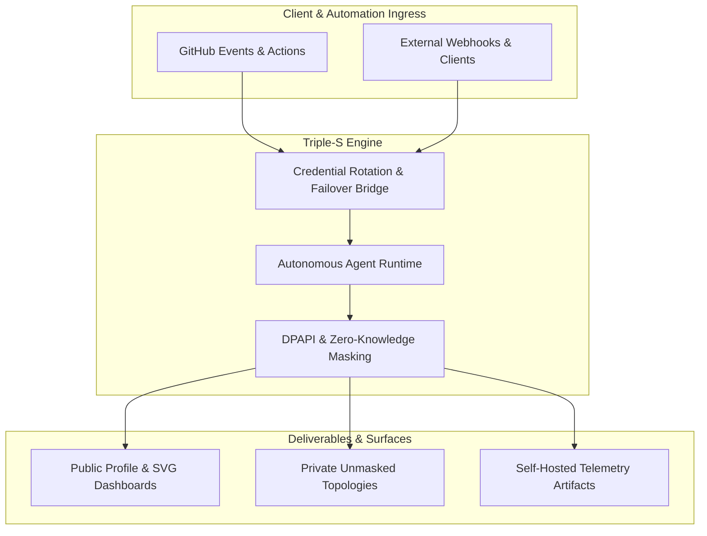

# KS-SSS-AI System Architecture & Engineering Ethos

## 1. Overview & Vision
`KS-SSS-AI` specializes in autonomous software architectures, resilient system integrations, and high-throughput pipelines designed to operate with high reliability and zero friction.

Our core foundation rests on the **Triple-S Paradigm**:
- **⚡ Speed**: Minimal-overhead architectures, frictionless development loops, and rapid automated delivery.
- **🏛️ Scale**: Decoupled asynchronous backends, stateless microservices, and zero-SPOF topologies.
- **🔒 Security**: Zero-trust credential encapsulation, DPAPI protection, and privacy-preserving SHA-256 cartography.

---

## 2. Distributed Topologies & Failover Bridge
The infrastructure employs automated credential rotation and live quota failovers across distributed nodes:
- **Rate-Limit Resilience (429 Handling)**: When upstream services signal rate limits or token exhaustion, traffic seamlessly shifts across dynamic provider pools without interruption.
- **Dual Pipeline Model**: 
  - **Public Surfaces**: Public repositories, telemetry, and SHA-256 masked organization topology maps.
  - **Private Companion Topologies**: Unmasked telemetry for internal operations and security auditing.

---

## 3. Security & Zero-Trust Isolation
- **Secret Hygiene**: Zero persistent plaintext keys; all credentials injected via ephemeral environment schemas.
- **Privacy Masking**: Private repository names and sensitive identifiers are salted and hashed with SHA-256 before telemetry rendering.
- **Self-Contained Artifacts**: Zero runtime external dependencies in production profile visuals (SVG + GIF).
