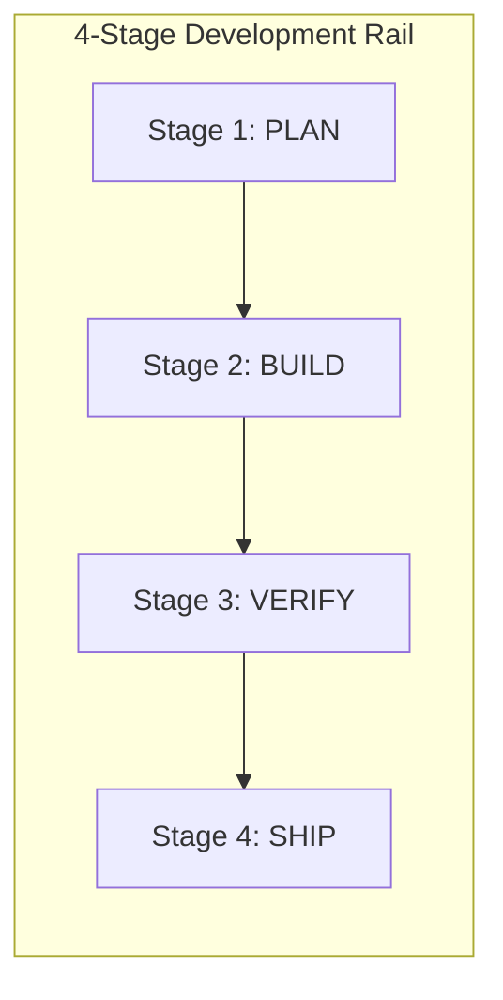

# Public Roadmaps Architecture & Visual Design

## Visual Structure

### 1. Project Roadmap (`project-roadmap.svg`)
- **ViewBox**: `0 0 480 400`
- **Lanes**:
  - `NOW`: Active sprint deliverables & immediate public milestones.
  - `NEXT`: Architectural items scheduled for next iterations.
  - `LATER`: Long-term evolutionary features and exploratory spikes.
- **Card Geometry**:
  - Dark container `#0F172A` with border `#1E293B`.
  - Neon accent borders (`#38BDF8` for NOW, `#818CF8` for NEXT, `#C084FC` for LATER).

### 2. Development Roadmap (`development-roadmap.svg`)
- **ViewBox**: `0 0 480 420`
- **Stages**:
  - `PLAN`: Requirements & architecture specs.
  - `BUILD`: Core development & distributed topology wiring.
  - `VERIFY`: DPAPI isolation & security audit.
  - `SHIP`: Synchronous 10-locale deployment & packaging.
- **Visual Rail**: Vertical dashed pipeline connecting circular nodes.

